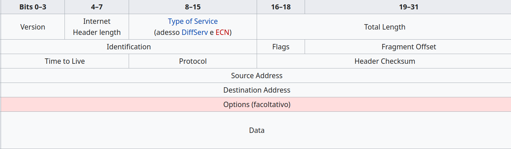

# Il protocollo IPv4

Il protocollo IP è stato determinato nel 1981 (la preistoria
praticamente) tramite l'[**RFC 791**](https://tools.ietf.org/html/rfc791) ed è il protocollo
fondamentale della rete Internet dal punto di vista del funzionamento
della stessa.

È il protocollo che si occupa dell'identificazione dei dispositivi
tramite il suo ***indirizzamento*** (appunto l'indirizzamento IPv4, di
cui studiamo a parte), questo significa che deve essere eseguito nel
100% dei dispositivi che vogliono utilizzare la rete Internet (l'unico
protocollo a presentare questa caratteristica).

È il protocollo che funge da interfaccia verso il livello di trasporto e
questo significa che è il primo protocollo di rete ad essere utilizzato
ed è dunque quello che si occupa dell'***impacchettamento***: riceve i
dati dal livello di trasporto e li prepara in pacchetti di rete definiti
**datagrammi**.

Avrete già notato che il protocollo IPv4 si occupa da solo di ben 2
compiti (su 4) di tutto il livello di rete. Beh... non è finita.

IPv4 È un protocollo **instradabile**, ovvero i pacchetti che esso crea,
i datagrammi, sono adatti per essere usati così come sono per le
operazioni di routing: questo significa che nessuno dei protocolli del
livello di rete modificherà più la struttura del pacchetto, ma
semplicemente inserirà o modificherà le informazioni necessarie per i
suoi scopi nell'header IP.

**È un protocollo non connesso e non affidabile: **ogni datagramma IP
(così si chiamano i suoi pacchetti) diretto verso una stessa
destinazione può seguire percorsi diversi, arrivare in ordine sparso o
addirittura non arrivare affatto!

La consegna non è garantita, ma il protocollo IP non se ne preoccupa: i
controlli di affidabilità della suite Internet sono eventualmente
affidati al livello di trasporto.

Il protocollo IP agisce da quando il dispositivo è acceso, tramite
l'indirizzamento. Quando il livello di trasporto gli invia dati da
elaborare, prima di tutto si occupa dell'impacchettamento e poi opera lo
smistamento secondo la seguente **logica di base del protocollo IP.**

Esso confronta l'indirizzo IP del mittente del pacchetto con quello del
destinatario e si comporta secondo le seguenti regole:

-   Se l'indirizzo IP del mittente è uguale all'IP del destinatario,
    oppure uno degli indirizzi è della classe 127, il pacchetto viene
    passato al livello superiore (tecnica del **loopback**).
-   Se il destinatario si trova sullo stesso segmento di rete del
    mittente, il pacchetto viene inviato in maniera diretta,
    individuando il destinatario tramite ARP (un altro protocollo di
    rete, che vedremo fra breve).
-   Se il destinatario NON si trova nella stessa rete del mittente, si
    invia il pacchetto al **default gateway**.

Per inviare i pacchetti nella rete, il protocollo IP può utilizzare una
delle seguenti modalità:

-   ***Unicasting***: è il caso più comune. Un pacchetto destinato ad un
    solo computer viene infatti definito unicast, quindi concettualmente
    una trasmissione unicasting corrisponde ad una trasmissione
    punto-a-punto. Si verifica quando l'indirizzo del destinatario è un
    indirizzo valido.
-   ***Broadcasting***: indica la spedizione di un generico pacchetto ad
    un indirizzo particolare che permetterà di consegnarlo a tutti i
    dispositivi collegati a quel segmento di rete. Si verifica quando
    l'indirizzo del destinatario è un indirizzo di broadcast.
-   ***Multicasting***: si intende la trasmissione contemporanea di
    frame ad un gruppo di dispositivi che hanno espresso interesse a
    riceverla. Il tipico esempio è quello delle trasmissioni
    multimediali in streaming. Si verifica quando l'indirizzo del
    destinatario è di classe D.

Vediamo l'intestazione (***header***) del datagramma IP:

{style="width:100%"}

Ok tranquilli... non si tratta di impararlo a memoria o riprodurlo
uguale durante le interrogazioni! Volevo solo mettere in evidenza alcune
informazioni che l'intestazione del datagramma IP si porta con sé,
quelle che ho messo in grassetto:

-   **0100**, il pacchetto IPv4 inizia con 4 in binario.
-   **lunghezza totale**, numero di byte che compongono il pacchetto.
    Sono 16 bit, quindi...
-   **TTL**, contatore della vita del pacchetto (Time To Live). Inizia
    da 30 o da 15 e scala di 1 ogni volta che si attraversa un router.
    Se arriva a zero, il pacchetto viene eliminato.
-   **CRC**, campo di controllo. Serve a verificare se il pacchetto è
    arrivato corrotto o no.
-   **indirizzi mittente e destinatario**, IP mittente e destinatario
-   **dati**, dati trasportati dal frame IP.

 
 

