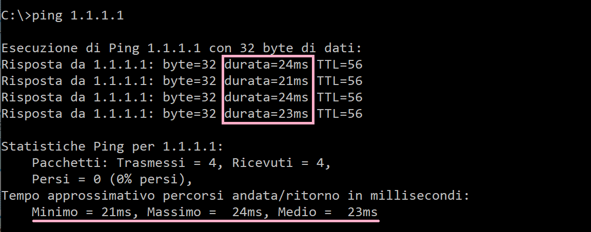

# ping


!!! note "Argomenti teorici e requisiti tecnici"
    
    Prerequisti: **Windows: command prompt. Linux, Mac: terminale**
    
    Argomenti trattati: **Indirizzamento IP**


ping è un software di diagnostica di rete, implementato in tutti i
sistemi operativi, che misura il tempo (in millisecondi) impiegato da
uno o più pacchetti ICMP a raggiungere un altro dispositivo di rete e
tornare indietro.

Tecnicamente ping invia un pacchetto ICMP di echo request e rimane in
attesa di un pacchetto ICMP di echo response in risposta. Solitamente
infatti la parte di OS dedicata alla gestione delle reti (stack di rete)
è impostata per rispondere automaticamente con un pacchetto echo
response alla ricezione di un pacchetto di echo request.

Il comando ping su Windows è impostato per inviare 4 pacchetti ICMP,
attendere 4 risposte e poi calcolare le statistiche di ricezione e
velocità. La sintassi del comando ping è la seguente:

``` bash
$ ping [opzioni] host
```

Evitiamo di addentrarci nel discorso delle opzioni del comando ping e
vediamo semplicemente il funzionamento e l'utilità dello stesso.



Come si vede, basta scegliere un target host (tramite IP o hostname) e
lanciare il comando. Al termine dell'esecuzione bisogna osservare i
pacchetti ritornati e le statistiche di viaggio degli stessi per
valutare la salute e le performance della rete stessa.

!!! warning "Attenzione!"
    
    Il comando ping su Windows è impostato automaticamente ad interrompersi
    dopo l'invio di 4 pacchetti.

    In ambienti Linux o Mac invece, il comando ping continua indefinitamente
    ad inviare pacchetti finché non lo si interrompe con un comando **CTRL +
    C** (mela + C su Mac). Quando viene interrotto l'invio vengono generate
    le statistiche.

Il comando ping insieme ai comandi ipconfig e traceroute sono un ottimo
strumento di diagnostica e sono semplicissimi da utilizzare.
L'importante è ragionare sui risultati che si ottengono e formulare
deduzioni appropriate.

---

**Ping test #1**

Nel primo test, valutiamo la connettività della nostra rete.
Controllando (con ipconfig/ifconfig/ip a seconda del sistema) abbiamo
visto che il nostro IP è 192.168.0.7 e che il nostro gatweway è
192.168.0.1.

I test da eseguire sono nell'ordine i seguenti

``` bash
# ping al nostro indirizzo
# se risponde significa che la scheda è attiva e funzionante
$ ping 192.168.0.7

# ping al nostro gatweway
# se risponde significa che la nostra rete è attiva e funzionante
$ ping 192.168.0.1

# ping ad un IP esterno
# se risponde significa che abbiamo connettività Internet
$ ping 1.1.1.1

# ping ad un host
# se risponde significa che anche la risoluzione DNS funziona!
$ ping google.it
```

Se tutti questi test hanno funzionato correttamente, potete stare certi
che il vostro dispositivo è ben connesso alla rete Internet. In caso
negativo, valutando quale test fallisce potete in maniera semplice
individuare il problema.

---

**Ping test #2**

Nel secondo test valutiamo la velocità dei server DNS che stiamo
utilizzando. Si tratta di risolvere un host tramite una risoluzione DNS
manuale e poi valutare la differenza di prestazioni fra il ping con
hostname e il ping con IP.

``` bash
# risoluzione
$ nslookup example.com
1.2.3.4

# ping HOSTNAME
$ ping example.com
...

# ping IP
$ ping 1.2.3.4
...
```

Ovviamente questo test è molto empirico e non sempre funziona poiché non
tutti i dispositivi rispondono ai ping :scream:

---

**Ping test #3**

Nel terzo test cercheremo di valutare la velocità della propria rete.
L'idea di base è questa. Si scelgono 3 siti a caso (ad esempio:
youtube.com, quotidiani.net, autoscout24.it) e si fanno i ping ad ognuno
di essi. Si osservano i valori scegliendo il più alto riportato nei tre
test e si valuta la rete secondo la seguente tabella:

| ping time (ms) | velocità rete |
|----------------|---------------|
| > 0 - 20       | Ottima        |
| 20 - 40        | Buona         |
| 40 - 60        | Discreta      |
| 60 - 80        | Sufficiente   |
| oltre 80       | ...           |


!!! warning "Okkio eh..."
    
    Questa tabella e questo modo di valutare la velocità di una rete hanno
    pochissime basi scientifiche e sono solo una stima di massima che io di
    solito faccio per valutare una rete.

    La velocità della rete dipende da moltissimi fattori, tra cui: i siti
    che visitate, l'orario di utilizzo, l'hardware a disposizione, la
    connessione wifi vs cablata, etc...


<br>
<br>

