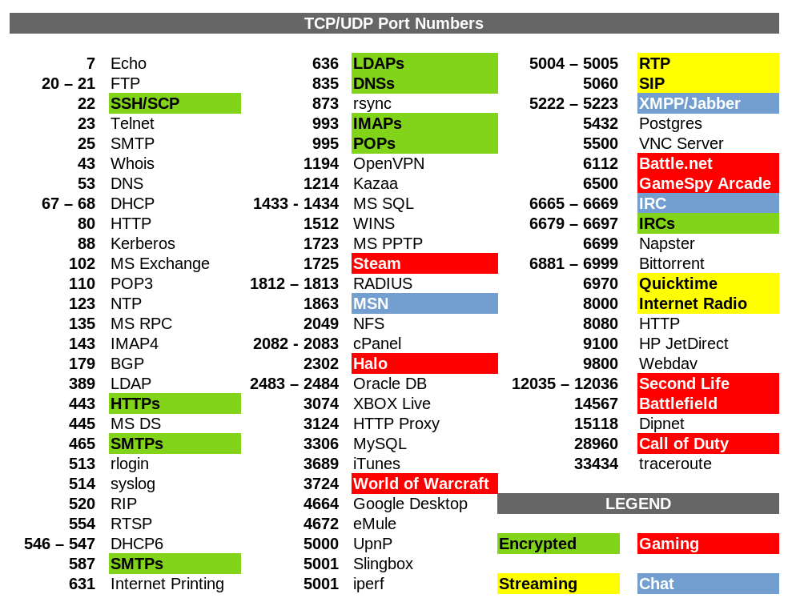

# Sockets e Porte

Il protocollo di trasporto per suddividere il traffico in entrata e
uscita fra le varie applicazioni che ne richiedono utilizza il
meccanismo delle porte logiche.

Le porte sono il mezzo essenziale che permette ai protocolli di
trasporto di gestire flussi multipli di dati attraverso una unica
connessione fisica alla rete.

Per fare un paragone con la vita reale immaginiamo di spedire una
lettera ad un amico. Se il destinatario vivesse in una abitazione
indipendente e ne fosse l'unico inquilino, sulla busta sarebbe
sufficiente indicare il suo indirizzo.

Questa situazione è però piuttosto inusuale in quanto, più
probabilmente, egli vivrà in un palazzo con altri condomini oppure
condividerà l'abitazione con altri parenti. Ognuno di questi può
ricevere posta al medesimo indirizzo e quindi per individuare
univocamente il destinatario sarà necessario specificare anche il suo
nome completo. Allo stesso modo indicheremo sulla busta le informazioni
riguardanti il mittente per poter ricevere una risposta.

Una cosa analoga avviene per le comunicazioni in rete attraverso la
suite TCP/IP. Ogni macchina sarà individuata sulla rete da un indirizzo
IP ma poiché molteplici possono essere i servizi offerti dal sistema e
molte le connessioni contemporanee, è necessario un metodo per separare
i singoli flussi di dati ed indirizzarli verso il corretto programma di
gestione.

A chi non è capitato per esempio di navigare e contemporaneamente di
scaricare la posta elettronica o usare un programma p2p? Come fa il
sistema a riconoscere a chi sono diretti i dati in arrivo?

Il problema viene risolto attraverso il meccanismo delle porte logiche,
nel confronto con l'esempio precedente, fanno le veci del nome del nome
del mittente e del destinatario.

Flussi di dati distinti diretti verso la stessa macchina sono
caratterizzati da porte diverse.

> Una connessione tra due dispositivi, a livello di trasporto, viene univocamente identificata dalle coppie:
> 
> 1.  "indirizzo IP : porta" del mittente
> 2.  "indirizzo IP : porta" del destinatario

Ognuna delle coppie "indirizzo IP: porta" rappresenta i dati
identificativi di un ***socket***, un oggetto software creato dal
livello di trasporto per identificare un dispositivo di rete.

Per identificare una connessione abbiamo dunque bisogno di 2 socket (per
individuare il punto di partenza e il punto di arrivo) allo stesso modo
in cui tramite due punti nel piano identifichiamo un segmento.

I protocolli del livello di trasporto utilizzano un identificatore a 16
bit (numeri da 0 a 65535), quindi questo rende possibili (teoricamente)
fino a 65536 socket contemporaneamente attivi per ogni porta fisica di
ogni dispositivo.

In linea di principio i numeri di porta per identificare un socket
potrebbero essere scelti arbitrariamente durante la connessione ma, come
vedremo, la cosa si rivelerebbe decisamente poco pratica.

Ogni comunicazione sulla rete presume che inizialmente, in una dei due
dispositivi coinvolti, ci sia un software "in ascolto", in attesa di un
contatto dall'esterno: un server.

Ad un certo punto un software in esecuzione sul secondo dispositivo
tenta di connettersi al primo: il client.

Se un dispositivo collegato ad un rete desidera comunicare con un altro
sistema deve necessariamente sapere l'indirizzo completo della macchina
remota. In questo caso quindi il client deve essere a conoscenza sia
dell'IP sia della porta su cui il server si aspetta di ricevere i dati
relativi al servizio di interesse.

Se il server scegliesse la porta in modo casuale nessuno saprebbe come
raggiungerlo.

Per questo motivo nasce l'esigenza di standardizzare e rendere pubblici
i numeri di porta relativi ai più comuni servizi disponibili (server) su
internet e sulle reti in genere.

In questo modo un client che volesse accedere ad un qualsiasi server
HTTP saprebbe a priori di doversi collegare alla porta TCP numero 80. Un
server di posta SMTP sarà sempre raggiungibile sulla sua porta TCP 25
così come un server FTP userà la TCP 21 e un DNS la porta UDP 53.

Contrariamente al caso precedente il client non ha mai l'esigenza di
rendere pubblico il suo indirizzo completo prima della connessione
perché questo verrà automaticamente comunicato al server nel momento in
cui verrà contattato.

In questo caso quindi il numero di porta del client può essere scelto
arbitrariamente dal sistema tra quelli al momento disponibili.

L'***Internet Assigned Numbers Authority*** (**IANA**) è l'ente che ha
tra i suoi scopi la standardizzazione delle porte e l'aggiornamento
costante di un documento, chiamato ports-number, contenente l'elenco dei
servizi registrati e delle relative porte utilizzate. A questo scopo,
nel suddetto documento, lo spazio delle 65536 porte UDP e TCP è stato
suddiviso in tre parti:

1. **Porte Note (da 0 a 1023)**

    L'accesso a queste porte è riservato a servizi con privilegi amministrativi. 
    Tipicamente ogni protocollo del livello superiore ha la sua porta più conosciuta (quella del server) in questo gruppo.
    
    
2. **Porte Registrate (da 1024 a 49151)**

    L'accesso a queste porte è libero per l'utilizzo da parte di chiunque.  
    Di solito, ogni protocollo del livello superiore ha una porta per il server in questo gruppo, in modo che chiunque possa eseguire
    un server *senza* privilegi amministrativi, ad esempio per motivi di test, di sviluppo, etc.
    
    Vi sono inoltre registrati tutti quei servizi che non necessitano di privilegi amministrativi, come i servizi p2p o i servizi di
    condivisione utente per file e stampanti.

    Ultima tipologia di porte registrate in questa area sono quei client di cui, per necessità del protocollo, è necessario conoscere a
    priori la porta utilizzata.

3. **Porte Dinamiche (da 49152 a 65535)**

    L'accesso a queste porte è libero per l'utilizzo da parte di chiunque e nessuna di esse può essere registrata per uno scopo
    particolare.  
    In questo gruppo tipicamente i client scelgono la loro porta da utilizzare per il socket necessario alla connessione.
    Nell'improbabile caso della saturazione di questo gruppo sono comunque utilizzabili anche le porte del secondo gruppo rimaste libere.

L'elenco completo delle porte assegnate può essere reperito nel documento pubblicato da IANA al seguente indirizzo web
(<http://www.iana.org/assignments/port-numbers>).

Nella tabella seguente elenco le porte utilizzate dai protocolli più comuni.

Ovviamente dovrete impararle tutte!

 
 

