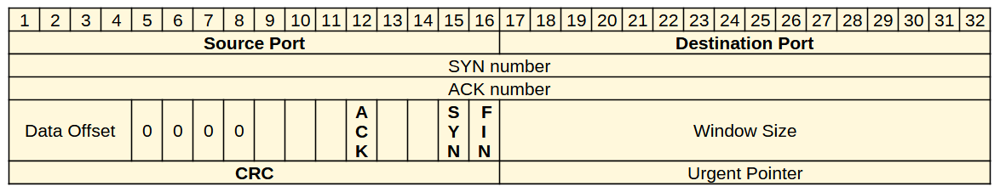

# Il protocollo TCP

Il protocollo TCP è senza dubbio il principale protocollo che implementa
il livello di trasporto nella suite Internet. È stato definito per la
prima volta nel 1981 tramite il documento [**RFC
793**](https://tools.ietf.org/html/rfc793), che ha subito
successivamente numerosi aggiornamenti.

Esso fornisce un metodo per garantire una consegna sicura e ordinata
delle informazioni, utilizzando metodi connessi e affidabili e
stabilendo connessioni punto a punto fra mittente e destinatario. Questo
implica dunque anche l'impossibilità di supportare broadcasting e
multicasting (tecniche di trasmissione "multipla" a livello di rete).

TCP riceve un flusso di dati da una applicazione e lo divide in TPDU
grandi solitamente 1500 byte, ma comunque non più di 64 Kb e li passa
poi al livello di rete, di cui utilizza sempre il protocollo IP.

L'intestazione del pacchetto TCP è di 20 byte, organizzati nel modo seguente:

Dove specifichiamo i campi più importanti:

-   la porta mittente e destinatario sono le porte logiche TCP del mittente e del destinatario
-   Gli 8 flag (bit) di stato servono per indicare informazioni come i pacchetti ***SYN, ACK, FIN***.
-   Il CRC (cyclic redundancy check) serve a verificare se il pacchetto è corrotto oppure no.

## Three way handshake

Il protocollo TCP, per stabilire una connessione utilizza il metodo
"***three way handshake***", ideato per assicurare al mittente la
presenza e la raggiungibilità del destinatario prima di iniziare
l'invio vero e proprio dei dati.

**Passo 1**

Il client invia una richiesta di connessione in un pacchetto denominato
SYN, contenente un identificativo A.

**Passo 2**

Se il server riceve questa notifica, questi risponde con un pacchetto
denominato SYN+ACK.

Il SYN è il pacchetto di sincronizzazione, contenente un identificativo
B; l'ACK è la conferma (acknoledgement) del SYN sopraggiunto, contenente
l'identificativo A + 1.

**Passo 3**

Se il client riceve il pacchetto SYN+ACK dal server, per lui la
connessione è aperta. Invia inoltre un pacchetto ACK di conferma
contenente l'identificativo B + 1.

Se il server riceve questa ulteriore informazione apre anch'esso la
connessione con il client.

 

La chiusura di una connessione avviene in genere anch'essa con il
metodo "***three way handshake***". Per concordare una chiusura:

una stazione manda un segnale di chiusura e fa partire un timer (passo 1);

la seconda quando riceve il segnale invia una conferma e chiude la connessione (passo 2).

Se la conferma arriva a destinazione, la prima stazione chiude la connessione, 
altrimenti lo fa comunque allo scadere del tempo cronometrato dal timer.

Questa differenza di comportamento fra apertura e chiusura si esplicita
nell'uso dei pacchetti: SYN e ACK per l'apertura, FYN e ACK per la
chiusura.

Analogamente, quando la connessione è stabilita e dopo ogni pacchetto
inviato, le stazioni fanno partire un timer oltre il quale chiudere la
connessione se non si riceve o invia nulla nel frattempo. Questa
strategia viene messa in atto per evitare di tenere in piedi connessioni
"eterne" fra stazioni che non trasmettono mai.

Per mantenere in piedi le connessioni quindi, il livello deve fare
"qualcosa", altrimenti il timer descritto chiuderà automaticamente la
connessione. Se i livelli superiori richiedono una connessione attiva
che dura nel tempo anche a fronte di nessun invio di dati (esempio: chat
in cui nessuno parla) il livello di trasporto mantiene attiva la
connessione inviando ad intervalli regolari dei pacchetti vuoti
(*dummy*), che appunto hanno l'unico scopo di mantenere viva la
connessione.

 
 

