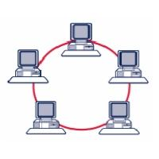

# Topologie di rete 

Studiando una rete qualsiasi (dalla rete Internet alla rete domestica, passando per la rete scolastica o quella di qualsiasi azienda)
incapperemo regolarmente in una serie di dispositivi, organizzati spazialmente e gerarchicamente in una topologia particolare, collegati
da una serie di cablaggi.

Cerchiamo di identificare i "blocchi organizzativi" che potremo trovare
osservando una qualsiasi rete di computer. 

---

**Topologia a bus**

{style="float:left; margin-right:30px"}

Questa topologia è di gran lunga la più semplice e la
più utilizzata in passato. Tutti i dispositivi facenti parte della rete
sono qui connessi ad un'unica dorsale, detta "***backbone***".

In un ambiente bus, solo un dispositivo alla volta può inviare una
informazione, quindi tutti gli utenti di una rete condividono la
quantità disponibile del tempo di transmissione. Inoltre la topologia a
bus è di tipo **passivo**, cioè i suoi dispositivi sono solo in attesa
dei dati spediti, senza essere coinvolti attivamente nel trasferimento.

Se uno qualsiasi dei dispositivi si guasta, questo non ha effetti sulla
rete, ma se si rompe (o si stacca) uno dei cavi in qualunque punto, la
rete diviene completamente inutilizzabile.

---

**Topologia ad anello**

{style="float:left; margin-right:30px"}

Quando ogni dispositivo è connesso direttamente al successivo in linea fino a chiudere un circolo, si parla di topologia ad
anello. In questa topologia, a differenza delle altre, ogni dispositivo ha dunque due cavi collegati. 
Siamo inoltre in presenza di una topologia
attiva, poiché ognuno dei dispositivi è responsabile, quando riceve un
segnale, di elaborarlo oppure rigenerarlo e farlo passare verso il
dispositivo successivo.

In questa topologia si utilizza un protocollo particolare definito
**"token passing"** per la sincronizzazione nell'utilizzo del canale.
Analogamente al gioco del testimone, un piccolo pacchetto, chiamato
token (gettone) passa lungo l'anello a turno su ogni dispositivo. Se
uno di questi deve trasmettere attacca al token una sequenza contenente
indirizzo di partenza (il proprio), indirizzo di arrivo (quello del
destinatario) e una sezione dati. L'informazione viaggia lungo
l'anello finché non raggiunge il destinatario oppure non ritorna dal
mittente (che decide se scartarla o provare un nuovo invio).

Questa topologia è mediamente la più veloce esistente, ma gli elevati
costi di installazione e la sua incredibile fragilità (ogni rottura,
spegnimento o malfunzionamento di computer o cablaggio termina la rete)
ne hanno limitato incredibilmente lo sviluppo su larga scala.

---

**Topologia a stella**

{style="float:left; margin-right:30px"}

La seguente topologia viene considerata la più robusta,
fra quelle esistenti e questo motivo ha fatto anche la sua fortuna,
rendendolo lo standard de facto delle architetture di rete. Ogni
dispositivo in una topologia a stella è connesso ad un dispositivo
centrale.

In questa topologia il guasto di uno qualsiasi dei cavi o dei
dispositivi di rete, non inficia in alcun modo il funzionamento della
rete; solo una rottura nell'HUB farebbe cadere il collegamento.

---

**Topologia a semireticolo**

{style="float:left; margin-right:30px"}

Questa particolare topologia presenta la caratteristica che ogni dispositivo è connesso *almeno*
ad un altro della stessa rete.

Interessante notare come, mentre le altre topologie possanno essere presenti sia sulle reti locali (LAN), che sulle reti geografiche (MAN, WAN)
questa topologia è tipica solo delle reti geografiche.

