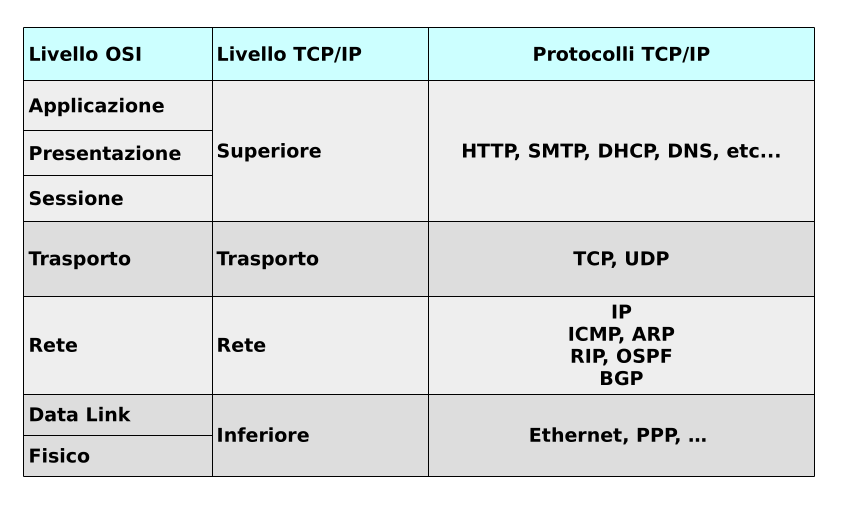

# Introduzione

La *Internet Protocol Suite*, nota anche con il nome *TCP/IP* o semplicemente *Internet Suite*, 
è un insieme di protocolli di rete che implementa la pila di protocolli su cui funziona Internet. 

Il nome TCP/IP ha preso piede per la grande importanza storica dei suoi due protocolli più rappresentativi:
TCP e IP.

Storicamente la sua implementazione è venuta come risposta ad un problema pratico, in forte contrasto
con lo sviluppo teorico del modello OSI, ma questo non ha minato la possibilità di confrontarli come
facce opposte della stessa medaglia.

{width=100%}

Durante i prossimi capitoli affronteremo quelle che sono le caratteristiche basilari di ognuno dei livelli.

Iniziamo!!!
