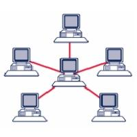
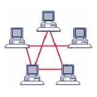

# Livello Inferiore

DA SISTEMARE

Il livello inferiore rappresenta il primo livello dello stack TCP/IP,
che lo rende in grado di accedere a qualunque tipo di rete, dispositivo,
mezzo trasmissivo. Il suo scopo primario è appunto quello di
implementare la trasmissione in tutti i sistemi fisici di comunicazione
conosciuti, rendendo trasparente al livello superiore (che per lui
sarebbe il livello di rete) il passaggio dei pacchetti.

Poiché i protocolli del livello inferiore sono strettamente connessi con
la realizzazione dei dispositivi che li andranno a implementare a
livello hardware, gran parte delle specifiche qui sono state
implementate da aziende, ingegneri e associazioni di questi, tra cui la
famosa IEEE.

IEEE ([http://www.ieee.org](http://www.ieee.org/)), acronimo di
***Institute of Electrical and Electronic Engineers***, è una
associazione internazionale di scienziati, ingegneri e professionisti,
con l'obiettivo della promozione scientifica e tecnologica. Dal 1963 ad
oggi, IEEE ha definito oltre 1000 standard industriali e pubblicato,
sotto la sua egida, oltre il 30% della bibliografia e documentazione
ingegneristica globale.

Le specifiche che riguardano il livello inferiore sono state pubblicate
nel 1980 dalla commissione denominata ***IEEE 802***, da cui prendono il
nome. I lavori della suddetta commissione erano preposti a sviluppare
standard per le reti "locali" e "metropolitane". La commissione ha
stabilito numerose specifiche, che si stanno evolvendo nel tempo, di cui
ricordiamo le principali:

Aggiungine qualcuna

  -------- --------------------------------------------------
  802.3    Ethernet: connettori e cavi di rete
  802.11   Wireless LAN
  802.15   Personal Area Network (Bluetooth, IrDA, etc...)
  802.16   WiMAX
  -------- --------------------------------------------------

ORGANIZZAZIONE IN DUE LIVELLI: 1 e 2 COME CON WIRESHARK SPIEGA E DIVIDI

IN UNA PAGINA!!!

Il livello inferiore della suite TCP/IP si occupa essenzialmente delle
seguenti operazioni:

  ---------------------------------------------------------------------- --
  trasformazione dei dati digitali da inviare in frame fisici separati   
  controllo degli errori di trasmissione                                 
  controllo di flusso dei dati                                           
  ---------------------------------------------------------------------- --

## Tipologie di rete

SCRIVERE

Devi parlare di tipologie (server based e p2p) e di LAN. MAN, WAN.

SOTTO è TUTTO OK!!!

### Struttura fisica delle reti

Studiando una rete qualsiasi (dalla rete Internet alla rete domestica,
passando per la rete scolastica o quella di qualsiasi azienda)
incapperemo regolarmente in una serie di dispositivi, organizzati
spazialmente e gerarchicamente in una topologia particolare, collegati
da una serie di cablaggi.

Cerchiamo di identificare i "blocchi organizzativi" che potremo trovare
osservando una qualsiasi rete di computer. Iniziamo distinguendole per
tipologia.

### Topologie per le reti locali

Sappiamo già che una rete locale (LAN) può essere definita come un
sistema di collegamento di dispositivi limitata geograficamente e senza
attraversamento di suolo pubblico.

La scelta della topologia di una rete ha un impatto incredibilmente
significativo sulla sua costituzione, arrivando ad influenzarne le
prestazioni, i costi, la scalabilità e il tipo di supporto da
acquistare.

Tutti le topologie per le reti locali utilizzate fino ad oggi si basano
su tre strutture di base, che potremmo definire i "mattorni" delle reti
locali: la topologia a bus, ad anello, a stella.

---

**Topologia a bus**

Questa topologia è di gran lunga la più semplice e la
più utilizzata in passato. Tutti i dispositivi facenti parte della rete
sono qui connessi ad un'unica dorsale, detta "***backbone***".

In un ambiente bus, solo un dispositivo alla volta può inviare una
informazione, quindi tutti gli utenti di una rete condividono la
quantità disponibile del tempo di transmissione. Inoltre la topologia a
bus è di tipo **passivo**, cioè i suoi dispositivi sono solo in attesa
dei dati spediti, senza essere coinvolti attivamente nel trasferimento.

Se uno qualsiasi dei dispositivi si guasta, questo non ha effetti sulla
rete, ma se si rompe (o si stacca) uno dei cavi in qualunque punto, la
rete diviene completamente inutilizzabile.

---

**Topologia ad anello**

Quando ogni dispositivo è connesso direttamente al
successivo in linea fino a chiudere un circolo, si parla di topologia ad
anello. In questa topologia, a differenza delle altre, ogni dispositivo
ha dunque due cavi collegati. Siamo inoltre in presenza di una topologia
attiva, poiché ognuno dei dispositivi è responsabile, quando riceve un
segnale, di elaborarlo oppure rigenerarlo e farlo passare verso il
dispositivo successivo.

In questa topologia si utilizza un protocollo particolare definito
"token passing" per la sincronizzazione nell'utilizzo del canale.
Analogamente al gioco del testimone, un piccolo pacchetto, chiamato
token (gettone) passa lungo l'anello a turno su ogni dispositivo. Se
uno di questi deve trasmettere attacca al token una sequenza contenente
indirizzo di partenza (il proprio), indirizzo di arrivo (quello del
destinatario) e una sezione dati. L'informazione viaggia lungo
l'anello finché non raggiunge il destinatario oppure non ritorna dal
mittente (che decide se scartarla o provare un nuovo invio).

Questa topologia è mediamente la più veloce esistente, ma gli elevati
costi di installazione e la sua incredibile fragilità (ogni rottura,
spegnimento o malfunzionamento di computer o cablaggio termina la rete)
ne hanno limitato incredibilmente lo sviluppo su larga scala.

---

**Topologia a stella**

La seguente topologia viene considerata la più robusta,
fra quelle esistenti e questo motivo ha fatto anche la sua fortuna,
rendendolo lo standard de facto delle architetture di rete. Ogni
dispositivo in una topologia a stella è connesso ad un dispositivo
centrale.

In questa topologia il guasto di uno qualsiasi dei cavi o dei
dispositivi di rete, non inficia in alcun modo il funzionamento della
rete; solo una rottura nell'HUB farebbe cadere il collegamento.

### Topologie per le reti geografiche

Le reti geografiche rappresentano genericamente tutte le tecnologie
utilizzate per collegare computer, o più in generale dispositivi, a
grande distanza: ad esempio Internet è una WAN a estensione mondiale ad
accesso più o meno libero.

Poiché computer e reti possono essere
dislocati più o meno in qualsiasi posizione, la topologia
delle WAN (Wide Area Network) non è ben definita come nel caso delle
topologie locali: si definisce quindi una generica ***topologia a
****semi ****reticolo***, intendendo così che ognuno dei dispositivi
della rete è collegato direttamente con almeno un'altra stazione della
rete.

I collegamenti fra le reti locali e quelle estese sono garantiti dai
router, dispositivi di instradamento del traffico.

Molte delle WAN esistenti inoltre, viste le distanze da coprire, non
hanno un canale hardware riservato e si appoggiano alle tecnologie
esistenti sul territorio.

Tra le miriadi di soluzioni inventate e proposte, la più comune e
affidabile, anche perché disponibile quasi ovunque, è la connessione
telefonica.

## Dispositivi di rete

I dispositivi di rete rappresentano tutti quei nodi in una rete che
hanno semplicemente il compito di far funzionare le comunicazioni, senza
realmente "partecipare" al dialogo.

Questi dispositivi vengono tipicamente classificati in base al livello
di rete in cui tipicamente lavorano:

---

**Livello Fisico**

-   ***HUB***: è il dispositivo di rete più semplice, tipicamente il
    centro di un collegamento a stella. La sua funzione è semplicemente
    quella di smistare il segnale in arrivo da un cavo in tutte le altre
    porte con una tecnica diffusiva. Per questa ragione viene
    tipicamente definito un "ripetitore multiporta".
-   **REPEATER**: nel campo delle telecomunicazioni un ripetitore può
    essere indistintamente un dispositivo analogico in grado di
    amplificare in uscita un segnale d'ingresso o un dispositivo
    digitale in grado di rigenerare un segnale per la trasmissione.

---

**Livello Data-Link**

-   **SWITCH**: lo switch (o "commutatore") è il dispositivo di rete che
    si occupa dell'instradamento a livello di rete locale, controllando
    gli indirizzi MAC inseriti nei vari frame e dirigendoli ognuno verso
    la NIC proprietaria dello stesso. Per questo motivo viene
    solitamente definito un "hub intelligente". Più formalmente, si dice
    che uno switch è in grado di minimizzare il **dominio di
    collisione** (l'insieme dei dispositivi che risentono di una
    collisione) senza modificare quello di broadcast (l'insieme dei
    dispositivi che ricevono i pacchetti di broadcast).
-   **BRIDGE**: questo dispositivo di rete serve a collegare tra loro
    due segmenti diversi dal punto di vista fisico, ma che rappresentano
    lo stesso segmento dal punto di vista logico. La sua caratteristica
    principale consiste nel separare in un diverso dominio di collisione
    i segmenti fisici ad esso collegati.

---

**Livello di Rete**

-   **ROUTER**: Il router è senza dubbio il più complesso ed
    interessante dispositivo di rete ed è quello che si occupa
    dell'instradamento dei pacchetti su reti diverse,
    dell'aggiornamento e della manutenzione della tabella di routing,
    del controllo delle liste di accessi (ACL) basate su IP e delle
    cosiddette LAN Virtuali (VLAN).

