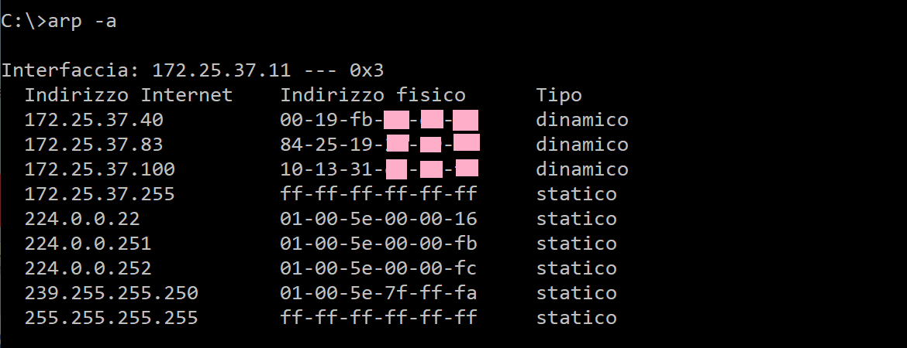

# arp


!!! note "Argomenti teorici e requisiti tecnici"
    
    Prerequisti: **Windows: command prompt, Linux, Mac: terminale**
    
    Argomenti trattati: **Protocolli IP, ARP**


L'utility di rete ARP serve per accedere alla cache arp (appunto) in
cui vengono mantenute le informazioni sul **neighbourhood** del
dispositivo, ovvero sui dispositivi contattabili direttamente da esso,
senza l'ausilio del gateway predefinito, tramite un invio diretto.

Come sappiamo il protocollo ARP funge da strumento di risoluzione degli
indirizzi (ARP sta per Address Resolution Protocol) e infatti abbina
ogni indirizzo IP contattabile (*reachable*) nella rete del dispositivo
al suo indirizzo MAC.

Vediamo la sintassi generale:

``` bash
$ arp [opzioni]
```

Le opzioni realmente interessanti sono solo 3 e sono quelle che servono
per:

1. visualizzare la cache ARP,
2. aggiungere una voce alla cache (una coppia IP-MAC)
3. cancellare una voce (o tutte) da essa.

Ovviamente le operazioni di modifica della cache (inserimento e/o
cancellazione) richiedono privilegi amministrativi mentre la
visualizzazione della stessa è sempre abilitata perché qualunque
software per accedere alla rete deve poterne usufruire.

Vediamo le opzioni:


| Opzione                        | Significato                                                   |
|--------------------------------|---------------------------------------------------------------|
| -a                             | Visualizza la cache ARP                                       |
| -s indirizzo_IP indirizzo_MAC  | Inserisce la coppia IP:MAC nella cache ARP                    |
| -d indirizzo_IP                | Elimina la voce corrispondente a indirizzo_IP dalla cache ARP |
| -d                             | Cancella tutta la cache ARP                                   |

Come vedete le opzioni sono poche e semplici. Ancora più semplice se si
considera che nel 99% dei casi l'unica che si utilizza è quella per
visualizzare la cache corrente:



---

**Esercizio di comprensione**

1. Visualizza la cache ARP del PC nel laboratorio.
2. Prova a pingare un altro dispositivo del laboratorio acceso ma non presente in cache
3. Visualizza di nuovo la cache ARP
4. Prova a pingare un sito web qualsiasi
5. Visualizza di nuovo la cache ARP

Osserva quello che è cambiato nelle 3 visualizzazioni e conferma quanto
abbiamo studiato.

