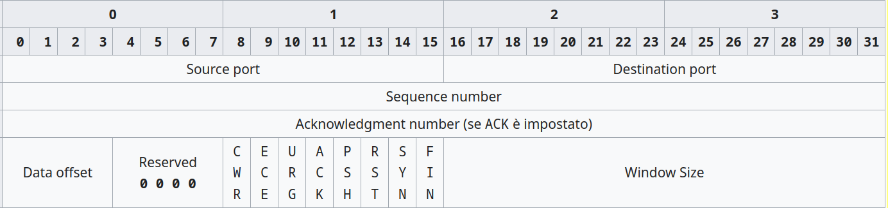
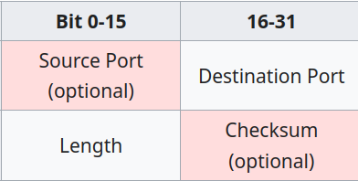

# Il Livello di Trasporto

Il livello di trasporto gestisce la conversazione tra mittente e
destinatario, nascondendo tutti i dettagli relativi al trasporto delle
informazioni lungo la rete.

I compiti del livello si possono inizialmente riassumere come nel
disegno sottostante: prende i dati dal livello applicazione, li divide
in pacchetti, vi aggiunge un'intestazione e li passa al sottostante
livello di rete.

La Suite Internet offre a livello di trasporto due protocolli:

- **TCP** (Transmission Control Protocol) connesso e affidabile
- **UDP** (User Datagram Protocol) non connesso e non affidabile

 

A livello di trasporto, i termini connessione e affidabilità significano:

1.  ***connessione:***

    Un servizio si dice connesso (a livello di trasporto) quando si preoccupa di stabilire una comunicazione 
    con il destinatario preventiva all'invio reale dei dati.

2.  ***Affidabilità:***

    Un servizio si dice affidabile (a livello di trasporto) quando si preoccupa di rinviare al destinatario 
    ogni pacchetto che non gli è arrivato (o che gli è arrivato corrotto).

Un servizio di trasporto connesso e affidabile si preoccupa di stabilire una comunicazione preventiva con il destinatario.
Se questi è disponibile, invia i pacchetti numerandoli alla partenza e riordinandoli all'arrivo; in caso di pacchetti
corrotti o mancanti si preoccupa di richiedere al mittente un nuovo invio di dati, assicurando un arrivo completo degli stessi,
oppure una dichiarata impossibilità a ricevere i dati.

Un servizio di trasporto non connesso e non affidabile inizia subito l'invio dei pacchetti nell'ordine in cui essi sono arrivati dal livello precedente.
All'arrivo scarta semplicemente i pacchetti corrotti, senza richiedere alcun reinvio, toglie l'intestazione del livello di trasporto 
e passa il dato al livello superiore.

!!! note "Perché due protocolli?"

    **TCP è connesso e affidabile.**

    Alcune applicazioni, come ad esempio quelle per inviare mail o files,
    hanno bisogno di essere sicure che i loro dati arrivino tutti a
    destinazione e possono accettare piccoli rallentamenti nel trasporto.

    Queste applicazioni scelgono TCP.

     
    
    **UDP è non connesso e non affidabile.**

    Alcune applicazioni, ad esempio quelle di video e audio streaming,
    gestiscono i dati in maniera che anche con piccoli "buchi" o "errori"
    essi siano fruibili; preferiscono "scartare" alcune parti del dato pur
    di proseguire nella trasmissione e non necessitano di un riordinamento.

    Queste applicazioni scelgono UDP.

## Sockets e Porte

Il protocollo di trasporto per suddividere il traffico in entrata e
uscita fra le varie applicazioni che ne richiedono utilizza il
meccanismo delle porte logiche.

Le porte sono il mezzo essenziale che permette ai protocolli di
trasporto di gestire flussi multipli di dati attraverso una unica
connessione fisica alla rete.

Per fare un paragone con la vita reale immaginiamo di spedire una
lettera ad un amico. Se il destinatario vivesse in una abitazione
indipendente e ne fosse l'unico inquilino, sulla busta sarebbe
sufficiente indicare il suo indirizzo.

Questa situazione è però piuttosto inusuale in quanto, più
probabilmente, egli vivrà in un palazzo con altri condomini oppure
condividerà l'abitazione con altri parenti. Ognuno di questi può
ricevere posta al medesimo indirizzo e quindi per individuare
univocamente il destinatario sarà necessario specificare anche il suo
nome completo. Allo stesso modo indicheremo sulla busta le informazioni
riguardanti il mittente per poter ricevere una risposta.

Una cosa analoga avviene per le comunicazioni in rete attraverso la
suite TCP/IP. Ogni macchina sarà individuata sulla rete da un indirizzo
IP ma poiché molteplici possono essere i servizi offerti dal sistema e
molte le connessioni contemporanee, è necessario un metodo per separare
i singoli flussi di dati ed indirizzarli verso il corretto programma di
gestione.

A chi non è capitato per esempio di navigare e contemporaneamente di
scaricare la posta elettronica o usare un programma p2p? Come fa il
sistema a riconoscere a chi sono diretti i dati in arrivo?

Il problema viene risolto attraverso il meccanismo delle porte logiche,
nel confronto con l'esempio precedente, fanno le veci del nome del nome
del mittente e del destinatario.

Flussi di dati distinti diretti verso la stessa macchina sono
caratterizzati da porte diverse.

> Una connessione tra due dispositivi, a livello di trasporto, viene univocamente identificata dalle coppie:
> 
> 1.  "indirizzo IP : porta" del mittente
> 2.  "indirizzo IP : porta" del destinatario

Ognuna delle coppie "indirizzo IP: porta" rappresenta i dati
identificativi di un ***socket***, un oggetto software creato dal
livello di trasporto per identificare un dispositivo di rete.

Per identificare una connessione abbiamo dunque bisogno di 2 socket (per
individuare il punto di partenza e il punto di arrivo) allo stesso modo
in cui tramite due punti nel piano identifichiamo un segmento.

I protocolli del livello di trasporto utilizzano un identificatore a 16
bit (numeri da 0 a 65535), quindi questo rende possibili (teoricamente)
fino a 65536 socket contemporaneamente attivi per ogni porta fisica di
ogni dispositivo.

In linea di principio i numeri di porta per identificare un socket
potrebbero essere scelti arbitrariamente durante la connessione ma, come
vedremo, la cosa si rivelerebbe decisamente poco pratica.

Ogni comunicazione sulla rete presume che inizialmente, in una dei due
dispositivi coinvolti, ci sia un software "in ascolto", in attesa di un
contatto dall'esterno: un server.

Ad un certo punto un software in esecuzione sul secondo dispositivo
tenta di connettersi al primo: il client.

Se un dispositivo collegato ad un rete desidera comunicare con un altro
sistema deve necessariamente sapere l'indirizzo completo della macchina
remota. In questo caso quindi il client deve essere a conoscenza sia
dell'IP sia della porta su cui il server si aspetta di ricevere i dati
relativi al servizio di interesse.

Se il server scegliesse la porta in modo casuale nessuno saprebbe come
raggiungerlo.

Per questo motivo nasce l'esigenza di standardizzare e rendere pubblici
i numeri di porta relativi ai più comuni servizi disponibili (server) su
internet e sulle reti in genere.

In questo modo un client che volesse accedere ad un qualsiasi server
HTTP saprebbe a priori di doversi collegare alla porta TCP numero 80. Un
server di posta SMTP sarà sempre raggiungibile sulla sua porta TCP 25
così come un server FTP userà la TCP 21 e un DNS la porta UDP 53.

Contrariamente al caso precedente il client non ha mai l'esigenza di
rendere pubblico il suo indirizzo completo prima della connessione
perché questo verrà automaticamente comunicato al server nel momento in
cui verrà contattato.

In questo caso quindi il numero di porta del client può essere scelto
arbitrariamente dal sistema tra quelli al momento disponibili.

L'***Internet Assigned Numbers Authority*** (**IANA**) è l'ente che ha
tra i suoi scopi la standardizzazione delle porte e l'aggiornamento
costante di un documento, chiamato ports-number, contenente l'elenco dei
servizi registrati e delle relative porte utilizzate. A questo scopo,
nel suddetto documento, lo spazio delle 65536 porte UDP e TCP è stato
suddiviso in tre parti:

1. **Porte Note (da 0 a 1023)**

    L'accesso a queste porte è riservato a servizi con privilegi amministrativi. 
    Tipicamente ogni protocollo del livello superiore ha la sua porta più conosciuta (quella del server) in questo gruppo.
    
    
2. **Porte Registrate (da 1024 a 49151)**

    L'accesso a queste porte è libero per l'utilizzo da parte di chiunque.  
    Di solito, ogni protocollo del livello superiore ha una porta per il server in questo gruppo, in modo che chiunque possa eseguire
    un server *senza* privilegi amministrativi, ad esempio per motivi di test, di sviluppo, etc.
    
    Vi sono inoltre registrati tutti quei servizi che non necessitano di privilegi amministrativi, come i servizi p2p o i servizi di
    condivisione utente per file e stampanti.

    Ultima tipologia di porte registrate in questa area sono quei client di cui, per necessità del protocollo, è necessario conoscere a
    priori la porta utilizzata.

3. **Porte Dinamiche (da 49152 a 65535)**

    L'accesso a queste porte è libero per l'utilizzo da parte di chiunque e nessuna di esse può essere registrata per uno scopo
    particolare.  
    In questo gruppo tipicamente i client scelgono la loro porta da utilizzare per il socket necessario alla connessione.
    Nell'improbabile caso della saturazione di questo gruppo sono comunque utilizzabili anche le porte del secondo gruppo rimaste libere.

L'elenco completo delle porte assegnate può essere reperito nel documento pubblicato da IANA al seguente indirizzo web
(<http://www.iana.org/assignments/port-numbers>).

Nella tabella seguente elenco le porte utilizzate dai protocolli più comuni.

Ovviamente dovrete impararle tutte!

(in realtà, le studieremo 2 o 3 alla volta parlando del relativo
protocollo)

| Protocollo                 | Porta |
|----------------------------|-------|
| DHCP server (BOOTP)        |    67 |
| DHCP client (BOOTP)        |    68 |
| DNS                        |    53 |
| DNS over TLS               |   853 |
| HTTP                       |    80 |
| HTTP (porta registrata)    |  8080 |
| HTTP over TLS (HTTPS)      |   443 |
| SMTP                       |    25 |
| SMTP over TLS (SUBMISSION) |   587 |
| POP                        |   110 |
| POP over TLS               |   995 |
| IMAP                       |   143 |
| IMAP over TLS              |   993 |

## Qualità del Servizio

QoS (Quality of Service) é un servizio aggiuntivo introdotto nel livello
di trasporto che permette di specificare appunto la qualità del servizio
richiesta.

L'utilità di siffatto servizio si nota soprattutto nelle reti
medio/grandi, dove c'è un più che discreto traffico di dati e alcune
connessioni necessitano di una "qualità" comunque elevata. La qualità in
evidenza è la velocità di trasferimento dei dati. Sostanzialmente si può
specificare un range di valori entro il quale definire la qualità del
servizio per differenziare a dovere le diverse necessità.

Ad esempio, se un server di posta consegna una mail con mezzo secondo di
ritardo (ma anche con mezzo minuto) nessuno se ne accorge o ci fa caso:
questa trasmissione può accontentarsi del valore più basso della scala.

Se un applicazione di video streaming trasmette ogni frame video con un
ritardo di mezzo secondo, allora sì che la gente se ne accorge: una tale
trasmissione dovrà richiedere il più alto livello di qualità del
servizio!

## Il protocollo TCP

Il protocollo TCP è senza dubbio il principale protocollo che implementa
il livello di trasporto nella suite Internet. È stato definito per la
prima volta nel 1981 tramite il documento [**RFC
793**](https://tools.ietf.org/html/rfc793), che ha subito
successivamente numerosi aggiornamenti.

Esso fornisce un metodo per garantire una consegna sicura e ordinata
delle informazioni, utilizzando metodi connessi e affidabili e
stabilendo connessioni punto a punto fra mittente e destinatario. Questo
implica dunque anche l'impossibilità di supportare broadcasting e
multicasting (tecniche di trasmissione "multipla" a livello di rete).

TCP riceve un flusso di dati da una applicazione e lo divide in TPDU
grandi solitamente 1500 byte, ma comunque non più di 64 Kb e li passa
poi al livello di rete, di cui utilizza sempre il protocollo IP.

L'intestazione del pacchetto TCP è di 20 byte, organizzati nel modo seguente:

Dove specifichiamo i campi più importanti:

-   la porta mittente e destinatario sono le porte logiche TCP del mittente e del destinatario
-   Gli 8 flag (bit) di stato servono per indicare informazioni come i pacchetti ***SYN, ACK, FIN***.
-   Il CRC (cyclic redundancy check) serve a verificare se il pacchetto è corrotto oppure no.

### Three way handshake

Il protocollo TCP, per stabilire una connessione utilizza il metodo
"***three way handshake***", ideato per assicurare al mittente la
presenza e la raggiungibilità del destinatario prima di iniziare
l'invio vero e proprio dei dati.

**Passo 1**

Il client invia una richiesta di connessione in un pacchetto denominato
SYN, contenente un identificativo A.

**Passo 2**

Se il server riceve questa notifica, questi risponde con un pacchetto
denominato SYN+ACK.

Il SYN è il pacchetto di sincronizzazione, contenente un identificativo
B; l'ACK è la conferma (acknoledgement) del SYN sopraggiunto, contenente
l'identificativo A + 1.

**Passo 3**

Se il client riceve il pacchetto SYN+ACK dal server, per lui la
connessione è aperta. Invia inoltre un pacchetto ACK di conferma
contenente l'identificativo B + 1.

Se il server riceve questa ulteriore informazione apre anch'esso la
connessione con il client.

 

La chiusura di una connessione avviene in genere anch'essa con il
metodo "***three way handshake***". Per concordare una chiusura:

una stazione manda un segnale di chiusura e fa partire un timer (passo 1);

la seconda quando riceve il segnale invia una conferma e chiude la connessione (passo 2).

Se la conferma arriva a destinazione, la prima stazione chiude la connessione, 
altrimenti lo fa comunque allo scadere del tempo cronometrato dal timer.

Questa differenza di comportamento fra apertura e chiusura si esplicita
nell'uso dei pacchetti: SYN e ACK per l'apertura, FYN e ACK per la
chiusura.

Analogamente, quando la connessione è stabilita e dopo ogni pacchetto
inviato, le stazioni fanno partire un timer oltre il quale chiudere la
connessione se non si riceve o invia nulla nel frattempo. Questa
strategia viene messa in atto per evitare di tenere in piedi connessioni
"eterne" fra stazioni che non trasmettono mai.

Per mantenere in piedi le connessioni quindi, il livello deve fare
"qualcosa", altrimenti il timer descritto chiuderà automaticamente la
connessione. Se i livelli superiori richiedono una connessione attiva
che dura nel tempo anche a fronte di nessun invio di dati (esempio: chat
in cui nessuno parla) il livello di trasporto mantiene attiva la
connessione inviando ad intervalli regolari dei pacchetti vuoti
(*dummy*), che appunto hanno l'unico scopo di mantenere viva la
connessione.

## Il protocollo UDP

Il protocollo UDP è uno dei primi protocolli della suite Internet
progettati. Il documento [**RFC 768**](https://tools.ietf.org/html/rfc768) che lo definisce è stato reso
definitivo nel 1980 e, incredibile a dirsi, non è stato mai più
ritoccato o rivisto. Pensate inoltre che è un documento di sole 2
pagine... come dire... presto e bene!

UDP fornisce un metodo per spedire dati senza dover stabilire una
connessione con il destinatario (non connesso) e senza dover verificare
i dati arrivati ad esso (non affidabile). A dirla tutta non si preoccupa
nemmeno di riordinare i pacchetti giunti a destinazione.

Risulta quindi un protocollo molto veloce (leggi: più veloce di TCP, ma
molto più limitato) ed è inoltre l'unico protocollo di trasporto abile
alle trasmissioni in broadcast e multicast.

L'intestazione dei datagrammi UDP ha il seguente formato:

UDP fornisce soltanto i servizi essenziali del livello di trasporto:

-   multiplazione delle connessioni, tramite il meccanismo di
    assegnazione delle porte;
-   verifica dell'integrità dei dati, tramite il meccanismo CRC

Tutto questo per ridurre al minimo la latenza della connessione e
fornire un servizio rapido e leggero ai protocolli superiori.

Esempi di protocolli che utilizzano UDP sono:

-   DNS (nella versione originale, senza sicurezza)
-   DHCP (forzatamente, poiché invia i pacchetti in broadcast)
-   Tutti i protocolli di streaming audio/video e VoIP (di solito
    trasmessi su 2 canali: uno TCP per i comandi, uno UDP per il flusso
    dati)
    
