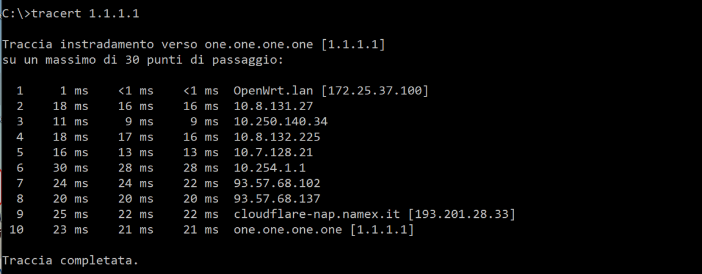

# traceroute

!!! note "Argomenti teorici e requisiti tecnici"
    
    Prerequisti: **Windows: command prompt. Linux, Mac: terminale**
    
    Argomenti trattati: **Protocolli IP, ICMP. Routing**

Prima d tutto chiariamoci su una importante banalità: il comando che
esegue l'operazione di *tracerouting* ha un nome diverso su Window, su
Linux, su Mac. Su Linux e Mac troviamo l'implementazione originale del
tool di rete, che si chiama come l'operazione che esegue:
**traceroute**.

Su Windows è stato progettato un nuovo tool, che si chiama **tracert**,
fa esattamente la stessa cosa del precedente, con una interfaccia
testuale sicuramente più carina e ordinata, al prezzo di ben tre ordini
di grandezza (millisecondi contro microsecondi) e di una divergenza
dallo standard che depone una volta di più sulla simpatica politica
dell'azienda con le finestre.

Allego 2 screenshot (il primo su Windows, il secondo su Linux, su Mac è
uguale a Linux) dell'esecuzione di un traceroute verso il target
**1.1.1.1** (scelto solo per la sua semplicità numerica).

Il traceroute utilizza i pacchetti ICMP di tipo, appunto, *traceroute*
per determinare i nodi di rete che il pacchetto attraversa. E verificare
dunque i salti che il pacchetto compie per andare dal punto A al punto
B.

 

Immagine dell'esecuzione di **tracert su Windows**.

 

Immagine dell'esecuzione di **traceroute su Linux o Mac**.

{style="width:100%"}

 

Analizzate i risultati ottenuti per comprendere al meglio il processo di routing dei pacchetti.

