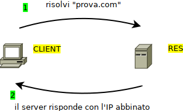
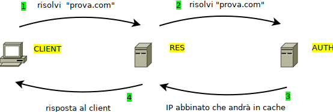
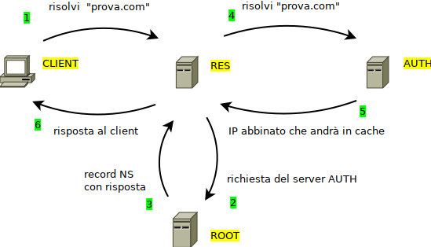

# Il protocollo DNS

Domain Name System (spesso indicato con DNS) è un protocollo del livello
superiore della ***Suite Internet*** utilizzato per la risoluzione di
nomi di host in indirizzi IP e viceversa.

I documenti di riferimento relativi sono storicamente [**RFC 1034 (Nomi di Dominio)**](https://tools.ietf.org/html/rfc1034) e 
[**RFC 1035 (Implementazione DNS)**](https://tools.ietf.org/html/rfc1035). 
Il protocollo prevede una implementazione basata sul paradigma client-server e Il suo servizio può utilizzare sia TCP che UDP sulla
porta 53. Le implementazioni originali tendono a favorire la scelta di UDP per motivi prestazionali.

I nomi DNS, conosciuti anche come ***nomi di dominio***, come ad esempio “google.it” o “facebook.com”, sono una delle caratteristiche più
visibili della rete Internet: questo ci fa capire quanto questo servizio sia “radicato” all'interno della rete stessa e necessario agli utenti
comuni per poterla utilizzare. I nomi di dominio sono l'informazione contenuta nell'host di ogni URL.

L’operazione di convertire un nome in un indirizzo viene definita `risoluzione DNS (DNS lookup)`, mentre quella di convertire
un indirizzo IP in nome è definita `risoluzione inversa (reverse lookup)`.

{style="width:100%"}

Come si evince chiaramente dalla figura, la risoluzione diretta e la risoluzione inversa ***non*** sono l’una la funzione inversa dell’altra,
ma semplicemente 2 funzioni completamente distinte con l’unica caratteristica in comune che, mentre il DNS lookup traduce un nome di
dominio in un indirizzo IP, il reserve lookup traduce un indirizzo IP in un nome di host.

## Nomi di dominio

Un **nome di dominio** è costituito da una serie di stringhe separate da punti, ad esempio

> reti . informatica . org

La parte più importante del nome di dominio è quella più a destra, nominata dominio di primo livello (TLD, ***Top Level Domain***). 
Ad esempio sono domini di primo livello “org”, “it”, “com” e così via.

A seguire verso sinistra abbiamo domini di secondo livello, terzo livello, etc...

Un dominio di secondo livello è costituito da due parti, per esempio “*informatica.org*”; 
un dominio di terzo livello è composto da tre parti e così via.

I domini di primo livello servono solo per la categorizzazione e non
possono identificare un host, mentre i domini dal secondo livello in poi
sì; quindi i domini di primo livello sono storicamente fissi e scelti da
ICANN (<https://it.wikipedia.org/wiki/ICANN>), la società che si occupa
di gestire il servizio DNS per la rete Internet, mentre quelli di
secondo livello sono in vendita per chiunque desideri acquistarne uno.
Quando un dominio di secondo livello viene registrato all’assegnatario,
questo è autorizzato (gratuitamente) a usare tutti i nomi di dominio
relativi ai successivi livelli al suo.

Ad esempio se un utente (a caso) ha acquistato il dominio “adjam.org”,
questo è autorizzato gratuitamente a utilizzare tutti i domini
successivi relativi, come ad esempio “studenti.adjam.org” oppure
“immagini.adjam.org”.

La registrazione di un dominio di secondo livello vale per un anno
solare, trascorso il quale l'utente deve confermare l'acquisto oppure
liberare il dominio per un nuovo (eventuale) utente interessato.

In realtà tutti i domini di primo livello convergono in un unico livello
base, definito livello zero oppure root level, identificato dalla
stringa vuota “” come se tutti i domini avessero un punto ulteriore:

> ...secondolivello.TLD.(stringavuota, livello zero)

Quindi la risoluzione di tutti i siti web parte da quella che viene
chiamata **DNS root zone**, a cui fa riferimento il livello ZERO. Come
vedremo, esistono 13 server autoritativi per la root zone, i cosiddetti
**DNS root servers **(<http://www.root-servers.org/>).

## Tipi di server DNS

I server DNS sono configurabili per funzionare in varie modalità, a
seconda del ruolo che devono svolgere nel sistema di risoluzione:

- se configurato in modalità “***resolver***”, il server risponde
  alle query dei client (anzi è l’unica modalità che interagisce coi
  client) interrogando la sua cache locale ed eventualmente rivolgendo
  la domanda agli altri tipi di server fino a che non è in grado di
  rispondere alla domanda. Nel caso di una nuova informazione il server
  fa cache della nuova informazione fino a che risulta valido, ovvero
  fino alla scadenza del TTL

- se configurato in modalità “***authoritative***”, il server diventa
  responsabile della risoluzione di tutti i nomi di dominio di un
  particolare TLD. Un server può essere autoritativo per un solo TLD e
  in quel caso diventa “l’autorità” per tutti i domini che terminano con
  quel TLD: se contiene una informazione bene, altrimenti significa che
  quell'informazione non esiste; se altri (server DNS) dicono una cosa
  diversa, sbagliano o hanno informazioni non aggiornate.

- se configurato in modalità “***root server***”, esso diventa
  responsabile di conoscere gli IP di tutti i server autoritativi per
  tutti i TLD esistenti. Se un resolver si trova a dover risolvere un
  nome di dominio che non ha in cache e non sa chi sia il server
  autoritativo per quel TLD, deve chiedere ad un root server.

  Esistono 13 root server in tutto il mondo e sono raggiungibili
  banalmente perché sono nominati con le lettere da A ad M (le prime 13
  lettere).

  Per informazioni su di essi: <https://root-servers.org/>

## Record DNS

Ad un nome DNS possono corrispondere diversi tipi di informazioni. Per
questo motivo, esistono diversi tipi di record DNS. Ogni voce del
database DNS deve essere caratterizzata da un tipo e da un TTL (Time To
Live): un tempo limite oltre il quale l'informazione contenuta nel
record DNS viene considerata obsoleta.

I principali tipi sono:

<table>
<tbody>
<tr class="odd">
<td>Record </td>
<td>Descrizione</td>
</tr>
<tr class="even">
<td>A</td>
<td>Da hostname a IPv4</td>
</tr>
<tr class="odd">
<td>AAAA</td>
<td>Da hostname a IPv6</td>
</tr>
<tr class="even">
<td>MX</td>
<td>Mail Exchange. Hostname per il server di posta</td>
</tr>
<tr class="odd">
<td>CNAME</td>
<td>Alias. Punta ad un record A oppure AAAA</td>
</tr>
<tr class="even">
<td>PTR</td>
<td>Serve per la risoluzione inversa. Da IP a Hostname.</td>
</tr>
<tr class="odd">
<td>SRV</td>
<td>Hostname per un servizio generico (generalizzazione di MX)</td>
</tr>
<tr class="even">
<td>NS</td>
<td>Dichiara il server DNS autorevole per quel nome di dominio.</td>
</tr>
</tbody>
</table>

**Esempi di risoluzione DNS**

Luca naviga su internet e cerca il sito “libero.it”. Il suo browser
invocherà una risoluzione DNS dell'host “libero.it”, chiedendo un record
di tipo A oppure AAAA.

Marco vuole inviare una mail a “<luca@libero.it>”. Il suo client di
posta invocherà una risoluzione DNS dell'host “libero.it” richiedendo un
record di tipo MX.

In questo modo allo stesso host ("libero.it" nell’esempio) si possono
abbinare 2 servizi diversi (web e mail) e questi 2 servizi possono
risiedere su host diversi: il servizio web nell’IP contenuto nel record
A, il servizio di posta nell’IP indicato nel record MX.

Magia del DNS...

## Come funziona la risoluzione DNS?

La risoluzione DNS è un’operazione estremamente comune nell’utilizzo
della rete Internet: praticamente ogni operazione di utilizzo della rete
(la navigazione sul web, le chat, il download, etc…) inizia con una
risoluzione DNS e soprattutto, diventa impossibile se questa fallisce.

Per comprendere il funzionamento della risoluzione DNS, faremo un
esempio partendo da un generico host denominato “prova.com” che un
client (un PC, un tablet, un telefono, un dispositivo qualsiasi…) prova
a risolvere.

Di sicuro l’operazione inizia con il client che richiede la risoluzione
dell’host ad un server di tipo resolver. Se il server ha il record A (o
AAAA) in cache, la risposta arriva subito.

 
 
{style="width:60%"}
 
 

Nel caso che il server di tipo resolver non abbia il record abbinato
all’host “prova.com”, ma conosca l’indirizzo del server autoritativo
“.com”, allora richiede la risoluzione a questo, risponde al client e fa
cache del risultato, in modo da poter fornire la risposta direttamente
in caso di nuova richiesta.

 
 
{style="width:80%"}
 
 

Nell’ultimo caso (il più... sfortunato) il server di tipo resolver che ha
ricevuto la richiesta per l’host di esempio “prova.com” non ha il record
per la risoluzione e non conosce il server autoritativo per il TLD
“.com”. La sua unica opzione è quella di chiedere prima ad uno dei root
server quale è il server autoritativo per quella zona. Ovviamente farà
cache anche di questa informazione in modo che alla prossima richiesta
di un sito “.com” sappia già a chi chiedere informazioni

 
 
{style="width:80%"}
 
 

I root server conoscono di certo la risposta, perché altrimenti questa…
non esiste!! L’individuazione di un root server è un’operazione semplice
come una risoluzione: come abbiamo detto infatti questi hanno dei nomi
predefiniti basati sulle prime 13 lettere dell’alfabeto, che seguono il
dominio predefinito “root-servers.net”.

Il root server A si può dunque individuare semplicemente risolvendo
l’host “a.root-servers.net”, il root server B corrisponde all’host
“b.root-servers.net” e così via…

I 13 server sono assolutamente paritetici: sincronizzano fra di loro le
informazioni, in modo che ognuno sappia le stesse cose di tutti gli
altri!

 
 

