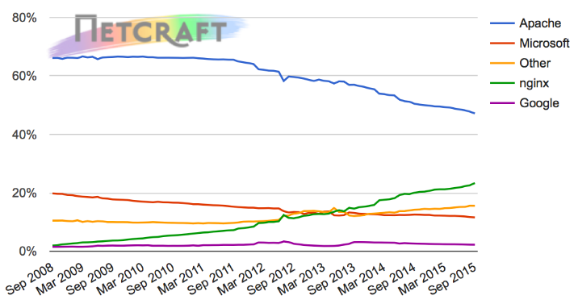
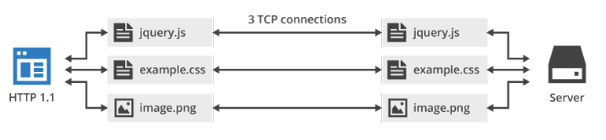
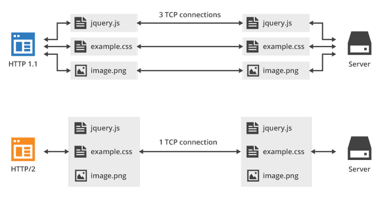

<!--
BASE: https://httpwg.org/specs/

The “core” semantics of the HTTP protocol are defined by:

    RFC9110: HTTP Semantics
    RFC9111: HTTP Caching

Those semantics are expressed “on the wire” in three ways:

    RFC9112: HTTP/1.1
    RFC9113: HTTP/2
    RFC9114: HTTP/3

ULTIMO:  HTTPS!!!

-->

# Il protocollo HTTP

HTTP, acronimo di Hyper Textual Transfer Protocol, è il protocollo utilizzato nella suite TCP/IP per il trasferimento di ipertesti. 

Come (sicuramente sappiamo) il `World Wide Web` (e dunque anche HTTP) è stato inventato da Tim Berners Lee nel 1991! Chiaramente HTTP è il protocollo alla base del www, 
ma non è l'unico protagonista in campo: ci sono i software (i client, cioè i browser, e i server web), ci sono i linguaggi del web (HTML, CSS, JS, PHP, etc...), ci sono una marea di specifiche che devono collaborare per far funzionare il tutto!!!

Per gestire tutte le specifiche del web è stato dunque fondato un consorzio, dedicato espressamente allo sviluppo di ognuna delle sue parti considerata nel contesto più ampio
del web: il [**W3C (World Wide Web Consortium)**](https://w3c.org/)!<br>
W3C non sviluppa direttamente il protocollo HTTP, ma verifica che le novità introdotte in esso tramite gli RFC siano compatibili con tutte le altre derivate dai linguaggi del web! 

Per quanto riguarda HTTP, la sua storia è in piena evoluzione!!!

La sua versione più famosa è probabilmente HTTP 1.1, pubblicata nel 1999 con il documento [**RFC 2616**](https://tools.ietf.org/html/rfc2616), che ha conciso con il boom della
diffusione del web sul pianeta!

La versione 2.0, incompatibile con la precedente, pubblicata come [**RFC 7540**](https://tools.ietf.org/html/rfc7540) nel maggio 2015, è stata introdotta per migliorare le 
performance del web 2.0 che aveva caratterizzato il decennio precedente.

A fianco di questo momento di evoluzione del protocollo interviene anche il massiccio spostamento dei siti web verso il protocollo https, 
che non è però tecnicamente un vero protocollo, quanto un livello di sicurezza aggiuntivo, che si interpone fra HTTP e TCP assicurando la cifratura dei dati.

La versione 3.0 uscita negli ultimi anni, ha richiesto una riorganizzazione completa dello Stack del web! Credo che per noi sia veramente troppo 
arrivare a studiare questa specifica, ancora in fase di implementazione dai vari software web!!!

Essendo HTTP un protocollo client/server necessita di due software per il suo funzionamento: i client web sono nient'altro che i comuni browser
per la navigazione internet. C'è poco da spiegare sui browser...

I server web invece sono software progettati per distribuire le pagine web e i loro contenuti ai client richiedenti. Una semplice immagine dice
più di 1000 parole:




## Il protocollo HTTP 1.1

Il protocollo HTTP 1.1 è un protocollo basato sulla tipologia client/server e sul meccanismo, comunissimo nelle comunicazioni di rete
di alto livello, di request/reply (richiesta/risposta): il client esegue una richiesta ed il server restituisce la risposta e poi la connessione
viene chiusa (protocollo ***stateless***, senza stato, cioè che non mantiene la connessione attiva).

Il protocollo HTTP 1.1 si appoggia a livello di trasporto sul protocollo TCP e utilizza lato server la porta 80.

Richiesta e risposta sono comunissimi file di testo: questo serve HTTP facile da implementare, gestire, studiare e "controllare". 
Ogni coppia request/reply corrisponde ad un unico file da scambiare fra client e server: questo significa che se un sito è costituito da una pagina con
50 immagini sono necessarie 51 richieste e risposte per ottenere tutto il suo contenuto!



Come descritto sopra esistono dunque due tipi di messaggi HTTP: i messaggi richiesta, inviati dai client HTTP e i messaggi risposta,
inviati dai server web.

In HTTP 1.1, Il ***messaggio di richiesta*** è composto di tre parti:

1.  Riga di richiesta (request line)
2.  Sezione Header (informazioni aggiuntive)
3.  Body (corpo del messaggio)

La riga di richiesta è composta a sua volta da tre informazioni:

-   la versione del protocollo: HTTP/1.1.
-   il metodo di richiesta; per HTTP/1.1 sono disponibili i metodi **GET, POST, HEAD, PUT, DELETE,TRACE, OPTIONS, CONNECT**.
-   L'`URL`; l'informazione che identifica l'oggetto della richiesta (ad esempio la pagina del sito che si vuole vedere).

Fra i metodi elencati, vale la pena evidenziare il metodo GET, il più utilizzato, che serve a richiedere una pagina specifica; 
il metodo POST, utilizzato per inviare dati dal client al server; 
il metodo PUT, utilizzato per l'upload di file, etc...

Gli header di richiesta più comuni sono:

-   **Host**: Nome del server a cui si riferisce l'URI. È obbligatorio
    nelle richieste conformi HTTP/1.1 perché permette l'uso dei virtual
    host basati sui nomi.
-   **User-Agent**: Identificazione del tipo di client: tipo browser,
    produttore, versione...
-   **Referer**: indica l'URL che ha "prodotto" la richiesta corrente.
-   **Accept-Language**: lista delle lingue che l'utente è in grado di comprendere

Il body contiene il corpo del messaggio. Il suo contenuto dipende dal metodo utilizzato:

-   è vuoto con il metodo GET
-   contiene i dati da inviare con il metodo POST
-   il file di cui fare l'upload con il metodo PUT
-   etc...

Esempio di richiesta HTTP 1.1

```
HTTP/1.1 GET 
Host: www.adjam.org
User-Agent: Mozilla/5.0 (Windows NT 6.1; WOW64) AppleWebKit/537.36 ...
Accept-Language: it
... (body) ...
```

Il ***messaggio di risposta*** è composto sempre dalle seguenti tre
parti, ognuna contenente una parte del messaggio da interpretare:

1.  Riga di stato (status-line)
2.  Sezione header
3.  Body (contenuto della risposta)

La riga di stato riporta un codice a tre cifre che identifica il tipo di
risposta. Per semplicità, possiamo considerarla non come tre caratteri
distinti, ma come un numero a tre cifre che va da 100 e 599. A seconda
della cifra più significativa del numero, la status-line riporta questi
gruppi di informazioni:

-   **1xx: Informational** (messaggi informativi, **non** di errore)
-   **2xx: Success** (la richiesta è stata soddisfatta)
-   **3xx: Redirection** (la risorsa non è presente, ma si hanno
    informazioni su come raggiungerla)
-   **4xx: Client error** (la richiesta non può essere soddisfatta
    perché sbagliata)
-   **5xx: Server error** (la richiesta non può essere soddisfatta per
    un problema interno del server)

Ovviamente non tutte le status line disponibili sono possibili.
Wikipedia riporta un elenco aggiornato delle status line esistenti
(<http://en.wikipedia.org/wiki/List_of_HTTP_status_codes>).

Gli header della risposta più comuni sono:

-   **Server:** Indica tipo e versione del server
-   **Content-Type:** Indica il tipo di contenuto restituito (tipo MIME).
-   **Content-encoding**: Indica se il contenuto è stato compresso oppure no.
-   **Content-length**: Indica la lunghezza in byte del body

Il body della risposta è tipicamente il posto dove troviamo le
informazioni trasportate: ad esempio, in caso di una richiesta GET, il
body della risposta contiene il file da trasportare al client.

Esempi di Risposta HTTP

```
HTTP/1.1 200 OK
Server: Apache
Content-Encoding: gzip
Content-Length: 1122
Content-Type: text/html
... (seguita dal body coi dati richiesti) ...
```


## Il protocollo HTTP 2.0

Il protocollo HTTP 2.0 è un protocollo basato sulla tipologia client/server e sul meccanismo richiesta/risposta. 
Utilizza come la precedente versione la porta 80 lato server su TCP.

La caratteristica principale di HTTP2 è la sua ricerca della prestazione rispetto al predecessore 
che ricercava invece la robustezza e la snellezza delle connessioni: essendo cambiati i tempi e le prestazioni
della rete fisica, il protocollo è stato rivisto per sfruttare al massimo le caratteristiche del protocollo TCP su cui si appoggia,
arrivando alle seguenti conclusioni:

-   HTTP2 cerca di minimizzare il numero delle connessioni TCP aperte (per la maggior parte dei casi ne basta una) 
    e di inviare tutti i dati in essa
-   HTTP2 organizza i dati da inviare nell'ordine in cui il client dovrebbe leggerli e poi li comprime con un algoritmo di
    compressione: questo fa sì che mentre HTTP 1.x invia dati in testo semplice, HTTP 2.x invia dati in modalità binaria, rendendo
    impossibile ogni tipo di gestione o controllo.

Anche qui... una immagine vale più di tante parole:



In HTTP2 ogni pacchetto è suddiviso in 2 parti:

1.  HEADER
2.  BODY

Nell'header si trovano informazioni analoghe a quelle del protocollo precedente, 
mentre il body contiene l'oggetto della richiesta (con la stessa logica di HTTP 1.1, come visto prima).

Il risultato è un unico file che verrà poi compresso per ridurre le dimensioni e ottimizzare l'invio.

Per valutare l'impatto sulle prestazioni che HTTP2 introduce nella rete
Internet, esistono alcuni siti che rendono il confronto molto evidente,
in particolare: <https://imagekit.io/demo/http2-vs-http1>.

Un'altra novità che l'introduzione di HTTP 2.0 aggiunge è forzare
l'adozione di HTTPS per tutti i siti web: anche se tecnicamente HTTP2 è
un semplice sostituto di HTTP1 i browser più comuni stanno forzando la
richiesta di HTTP2 e HTTPS insieme.

Vediamo dunque il funzionamento di HTTPS.

(in realtà no... perché non è pronto...)
