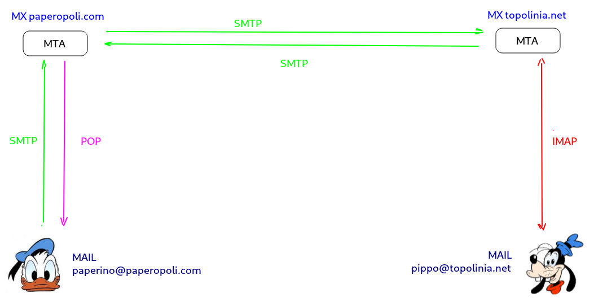

# La posta elettronica

Simple Mail Transfer Protocol è il protocollo standard per la trasmissione via internet di e-mail. 
Progettato nel 1982 tramite il documento [**RFC 821**](https://tools.ietf.org/html/rfc821), ha subito
ben 2 revisioni importanti con [**RFC 2821**](https://tools.ietf.org/html/rfc2821)** (2001)** ed 
[**RFC 5321**](https://tools.ietf.org/html/rfc5321)** (2008)**, 
entrambi tentativi mal riusciti, come vedremo, di aggiustare un protocollo
"*broken by design*" per le necessità del web moderno.

SMTP non è un protocollo basato sul paradigma client/server perché le
risorse (le mail) non sono disponibili sull'ipotetico server, ma nelle
mani e nella testa degli utenti, che non hanno intenzione di inviarle ad
un "software" ma che vogliono utilizzarle per comunicare con un altro
utente.

Il software che implementa il trasferimento delle mail tramite SMTP si
chiama **MTA (Mail Transport Agent)** e, analogamente ad un server, sta
in ascolto su una well known port, la porta 25/TCP.

Gli URL che identificano i "recipienti" (le caselle di posta) contenenti
le risorse (le mail) sono nient'altro che gli indirizzi di posta
elettronica, nella forma <user@host>.

Per risolvere l'host che identifica l'MTA che gestisce le sue caselle di
posta SMTP utilizza un particolare record DNS denominato MX (Mail
Exchange).

Poiché SMTP è un protocollo testuale basato sulla codifica ASCII, non è
permesso trasmettere direttamente testo composto con un diverso set di
caratteri e tanto meno file binari.

Vedremo più avanti che per aggirare questo ostacolo e inviare file
binari tramite SMTP (chi non ha mai allegato ad una mail un file pdf,
una immagine o un file mp3?) si utilizzano i `MIME Types`, uno
standard che permette di estendere il formato dei messaggi permettendo
di inviare dati binari come fossero file di testo semplice.

## SMTP e protocolli ausiliari

SMTP è un protocollo che permette soltanto di inviare messaggi di posta,
ma non di riceverli!

Sparata la frase ad effetto, spieghiamo meglio: SMTP gestisce lo scambio
di messaggi fra gli MTA, ovvero i software che gestiscono le caselle di
posta e lo scambio di messaggi fra queste.

Allora immaginiamo di avere a che fare con 2 MTA, quello che gestisce le
caselle di posta `paperopoli.com` e quello che
gestisce le caselle di posta `topolinia.net`.

Paperino ha un account di posta su paperopoli.com, mentre Pippo ne ha
uno su topolinia.net.

Quando <paperino@paperopoli.com> invia una mail a <pippo@topolinia.net>, Pippo non riceve la mail in maniera istantanea nel suo dispositivo! 
La mail inviata da Paperino va a finire nella casella di Pippo nell'MTA identificato dall'host `topolinia.net`.

Quando Pippo decide di controllare la posta si collega al suo server tramite un protocollo ausiliario e si fa una copia della posta per la
sua comoda lettura. I protocolli ausiliari fra cui scegliere per ricevere la posta sono solo due: POP e IMAP.

**POP** (Post Office Protocol) è un protocollo del livello superiore di
tipo client-server che permette, previa autenticazione, di eseguire sul
client una copia delle mail presenti sul server. Le mail per essere
lette devono essere copiate sul dispositivo utente locale. A quel punto
la posta può essere rimossa dal server e l'unica copia della posta è
quella che rimane sul client.

**IMAP** (Internet Message Access Protocol) è un altro protocollo del
livello superiore ausiliario alla posta. Tipicamente IMAP viene
considerato come "l'alternativa moderna" al protocollo POP!

La sua caratteristica principale sta nel fatto che, a differenza di POP,
mantiene una copia sincronizzata delle mail fra client e server,
mantenendo sempre aggiornata la copia lato server di tutte le modifiche,
mail lette, cancellate, risposte, etc...

Questo lo rende molto adatto all'utilizzo multiutente e/o alla
consultazione multi-dispositivo. Inoltre permette l'accesso sia online
che off-line alla posta (una volta scaricata. Alla successiva
connessione, le modifiche sul client saranno sincronizzate sul server) e
alla ricerca diretta sul server delle mail.

È molto importante sottolineare che i 3 protocolli SMTP, POP, IMAP sono
protocolli che gestiscono e inviano semplici file di testo e non
prevedono alcuna cifratura!

Mi preme inoltre sottolineare che, mentre POP e IMAP utilizzano almeno
la password utente per l'identificazione, benché la inviino in chiaro,
il protocollo SMTP per l'invio dei messaggi non prevede neppure
l'autenticazione!!

Non so davvero scegliere la scelta peggiore...

Per consultare la posta gli utenti utilizzano ovviamente un software:
l'applicazione sul telefono, il sito web che mi fa vedere la mail,
l'applicazione desktop che mi permette di consultarla... tutti questi
software vengono definiti **MUA (Mail User Agent)**. Impropriamente ci
si riferisce a questi come ai ***client di posta***, poiché devono
interagire con il protocollo SMTP per l'invio delle mail e con POP
oppure IMAP (a seconda della scelta dell'utente) per la ricezione.

## SMTP e sicurezza

Una delle (tante) limitazioni del protocollo SMTP originario è che non
gestisce l'autenticazione dei mittenti. Questo problema madornale
dipende da motivazioni "storiche"... SMTP è stato pensato negli anni '80
per lo scambio di informazioni e documenti in ufficio (da cui la sua
"aria" sempre un po' seriosa...): la sicurezza non era un problema da
considerare.

Se proiettiamo queste caratteristiche nella Internet del nuovo millennio
c'è poco da fare! Con SMTP lo *spam[^1]* con SMTP non è un rischio, è
una certezza...

Il problema principale di SMTP e della posta elettronica in generale è,
paradossalmente, il fatto che abbia avuto una così grande diffusione!
E' impensabile nel mondo di oggi sostituire SMTP con una
implementazione alternativa e sicura.

L'unica soluzione attuabile è quella di estendere in maniera
retro-compatibile il protocollo attuale.

Ecco spiegata la necessità delle due grandi revisioni del protocollo
SMTP (e dei suoi protocolli ausiliari), invece magari di inventare un
protocollo ex-novo, più moderno e più adatto alle necessità di oggi.

Nella prima revisione la novità più importante è stata quella della
estensione cosiddetta SMTP-AUTH, che obbliga gli utenti a utilizzare la
password per inviare la posta. In chiaro, ovviamente...

Nella seconda revisione (molto importante) si è finalmente arrivati a
progettare delle estensioni in grado di criptare il traffico SMTP (e
IMAP, e POP) in maniera analoga alla crittografia di HTTPS.

L'introduzione di queste estensioni nei sistemi dei maggiori fornitori
di indirizzi di posta elettronica ha avuto l'effetto di ridurre, ma non
debellare i problemi relativi alla sicurezza: lo spam, il phishing e le
truffe in genere via mail sono purtroppo ancora all'ordine del giorno.

## MIME Types

Il MIME Type (Multipurpose Internet Mail Extensions) é uno standard di
Internet che definisce il formato dei dati trasportati tramite mail.
Successivamente la tipizzazione MIME è stata introdotta anche per le
pagine web, cosicché ormai SMTP e HTTP la supportano entrambi
pienamente.

La trasmissione base dei dati supporta solo caratteri ASCII a 7 bit,
caratteristica sufficiente per mail e semplici pagine web, ma non per le
decine di file multimediali che ormai riempono la rete. Il MIME
definisce meccanismi atti a spedire contenuti binari come immagini,
suoni e filmati, oppure programmi, "ingannando" il protocollo che lo
utilizza (HTTP o SMTP) e facendo passare i dati come normali dati di
testo.

Lo standard MIME è espandibile. Le sue definizioni includono metodi per
definire nuovi tipi di contenuto e altri attributi MIME. I tipi di
contenuto predefiniti sono sette, di cui 5 sono tipi elementari:

-   *text*,
-   *audio*,
-   *image*,
-   *video*,
-   *application*.

Altri 2 sono tipi composti:

-   message,
-   multipart.

Ognuno di questi ha opportuni sottotipi, come `image/png` o `application/zip`. 
Il tipo MIME viene appeso come un header al contenuto
del pacchetto inviato e viene utilizzato dal destinatario per
interpretare correttamente i dati arrivati.

[^1]: Definizione di SPAM. Cosa è precisamente? E' illegale? Davvero??
