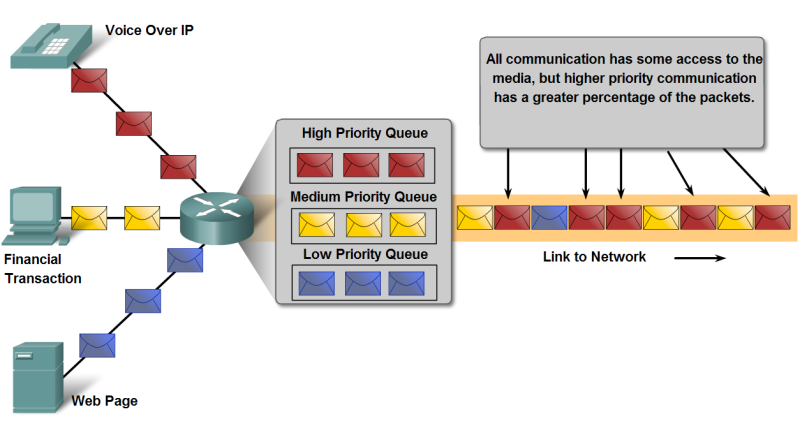

# Qualità del Servizio

QoS (Quality of Service) é un servizio aggiuntivo introdotto nel livello
di trasporto che permette di specificare appunto la qualità del servizio
richiesta.

L'utilità di siffatto servizio si nota soprattutto nelle reti
medio/grandi, dove c'è un più che discreto traffico di dati e alcune
connessioni necessitano di una "qualità" comunque elevata. La qualità in
evidenza è la velocità di trasferimento dei dati. Sostanzialmente si può
specificare un range di valori entro il quale definire la qualità del
servizio per differenziare a dovere le diverse necessità.

Ad esempio, se un server di posta consegna una mail con mezzo secondo di
ritardo (ma anche con mezzo minuto) nessuno se ne accorge o ci fa caso:
questa trasmissione può accontentarsi del valore più basso della scala.

Se un applicazione di video streaming trasmette ogni frame video con un
ritardo di mezzo secondo, allora sì che la gente se ne accorge: una tale
trasmissione dovrà richiedere il più alto livello di qualità del
servizio!

