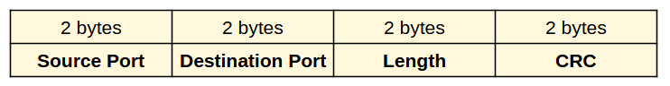

# Il protocollo UDP

Il protocollo UDP è uno dei primi protocolli della suite Internet
progettati. Il documento [**RFC 768**](https://tools.ietf.org/html/rfc768) che lo definisce è stato reso
definitivo nel 1980 e, incredibile a dirsi, non è stato mai più
ritoccato o rivisto. Pensate inoltre che è un documento di sole 2
pagine... come dire... presto e bene!

UDP fornisce un metodo per spedire dati senza dover stabilire una
connessione con il destinatario (non connesso) e senza dover verificare
i dati arrivati ad esso (non affidabile). A dirla tutta non si preoccupa
nemmeno di riordinare i pacchetti giunti a destinazione.

Risulta quindi un protocollo molto veloce (leggi: più veloce di TCP, ma
molto più limitato) ed è inoltre l'unico protocollo di trasporto abile
alle trasmissioni in broadcast e multicast.

L'intestazione dei datagrammi UDP ha il seguente formato:

UDP fornisce soltanto i servizi essenziali del livello di trasporto:

-   multiplazione delle connessioni, tramite il meccanismo di
    assegnazione delle porte;
-   verifica dell'integrità dei dati, tramite il meccanismo CRC

Tutto questo per ridurre al minimo la latenza della connessione e
fornire un servizio rapido e leggero ai protocolli superiori.

Esempi di protocolli che utilizzano UDP sono:

-   DNS (nella versione originale, senza sicurezza)
-   DHCP (forzatamente, poiché invia i pacchetti in broadcast)
-   Tutti i protocolli di streaming audio/video e VoIP (di solito
    trasmessi su 2 canali: uno TCP per i comandi, uno UDP per il flusso
    dati)

