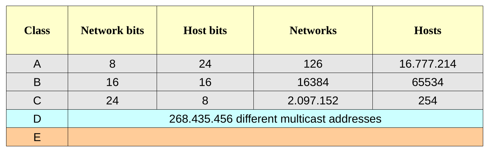

# Indirizzamento IPv4

Gli indirizzi IP sono numeri che identificano univocamente un dispositivo di rete. Sono organizzati in
blocchi di 32 bit e tradotti convenzionalmente nella notazione decimale puntata: questo significa che
ogni indirizzo verrà trascritto come una sequenza di quattro numeri decimali compresi fra 0 e 255 e
separati da punti.


> Un indirizzo potrebbe essere `11000000.10101000.00000000.00000001`, che é un numero binario a 32
> bit, ma per rappresentarlo lo si divide in byte (gruppi di otto) e li si trasforma in decimale. <br>
> La rappresentazione `192.168.0.1` (che è identica alla precedente) risulta a noi molto più chiara e
> leggibile.

``` title="Rappresentazione decimale puntata"
11000000 10101000 00000000 00000001
     192      168        0        1
```

Ogni indirizzo è solitamente suddivisibile in due parti: la **parte di rete** (network) e la **parte di host** (host). 

> **La suddivisione logica insita nell'indirizzamento IPv4 implica dunque una organizzazione fisica**<br><br>
> 
> Quando 2 dispositivi nella Rete hanno la stessa parte di rete, significa che sono fisicamente connessi allo stesso dispositivo di rete.<br>
> Vale anche il viceversa!<br>
> Quando 2 dispositivi sono fisicamente connessi, devono avere indirizzi con identica parte di rete


Vedremo successivamente come questa importante caratteristica di IPv4 sia in effetti anche il suo limite più grande.


L'insieme degli indirizzi è suddiviso in 5 gruppi definiti “ ***classi*** ” (A, B, C, D, E): 

- **Classe A**: indirizzi assegnabili a dispositivi in reti di grandi dimensioni
- **Classe B**: indirizzi assegnabili a dispositivi in reti di medie dimensioni
- **Classe C**: indirizzi assegnabili a dispositivi in reti di piccole dimensioni
- **Classe D**: indirizzi riservati al *multicasting*
- **Classe E**: indirizzi riservati per usi sperimentali

!!! tip "Suggerimento"

    In teoria delle reti, quando un indirizzo è assegnabile ad un host viene definito un indirizzo `valido`.
    Nell'indirizzamento IPv4 solo gli indirizzi delle classi A,B,C contengono indirizzi validi.


Dal punto di vista della composizione degli indirizzi in bit, le varie classi si distinguono dai primi bit di ogni indirizzo:


Se invece vogliamo studiare le classi guardando la loro rappresentazione decimale, valutando il numero di reti e di dispositivi ammissibili
per ogni rete, abbiamo:




## Network Address

> Si definisce ***network address*** (indirizzo di rete) quell'indirizzo che si calcola a partire da un qualunque
> indirizzo IP (anche se ha realmente senso solo per quelli di classe A, B, C) mettendo a **zero** tutti i bit
> della parte di host.

L'indirizzo di rete è un concetto analogo al cognome delle persone: definisce l'appartenenza ad una
gruppo. **Tutte le stazioni sullo stesso segmento di rete devono avere lo stesso indirizzo di rete** , cioè i
bit di rete dei due indirizzi devono coincidere.

Questo ci fa capire che gli indirizzi di rete (gli indirizzi con parte di host nulla) **non** possono essere
assegnati a dei singoli host, ma sono utilizzati per identificare le reti di appartenenza di questi.

Ecco alcuni esempi di indirizzi di rete:

- Dato l'indirizzo `15.0.1.2`, che appartiene alla classe A, l'indirizzo di rete a cui appartiene si identificherà mettendo a zero la parte di host, ottenendo quindi l'indirizzo `15.0.0.0`.

- L'indirizzo `15.100.4.73` ha la stessa parte di rete del precedente (`15.0.0.0`). Questo ci fa capire che entrambi gli indirizzi appartengono alla stessa rete fisica.

- L'indirizzo di classe A `100.102.103.104` ha indirizzo di rete `100.0.0.0`, quindi non appartiene alla stessa rete dei due precedenti.

- L'indirizzo di classe B `130.159.200.45` appartiene alla rete `130.159.0.0`.


## Broadcast Address

In analogia al Network Address, nelle reti troviamo un altro indirizzo speciale, il Broadcast Address.

> Si definisce **broadcast address** (indirizzo di broadcast) quell'indirizzo che si calcola a partire da un qualunque
> indirizzo IP (anche se ha realmente senso solo per quelli di classe A, B, C) mettendo a **uno** tutti i bit
> della parte di host. 

L'indirizzo di broadcast per una rete è un altro indirizzo speciale che non è assegnabile ad alcun dispositivo singolo. 
Viene utilizzato per comunicare contemporaneamente con tutti i dispositivi appartenenti alla rete.

Vediamo alcuni esempi:

- Dato l'indirizzo `15.0.1.2`, che appartiene alla classe A, l'indirizzo di broadcast della sua rete sarà l'indirizzo `15.255.255.255`.

- L'indirizzo di classe A `100.102.103.104` ha indirizzo di broadcast `100.255.255.255`.

- L'indirizzo di classe B `130.159.200.45` ha indirizzo di broadcast `130.159.255.255`.

- L'indirizzo di classe C `200.199.198.197` ha indirizzo di broadcast `200.199.198.255`.


## Subnet mask

Per meglio distinguere la parte di rete dalla parte di host in un indirizzo, si utilizza la tecnica della ***subnet mask*** (maschera di sottorete). 

> La **subnet mask** é una sequenza di 32 bit che contiene prima una sequenza di 1 e poi una sequenza di 0. 
> Il numero di 1 sta ad indicare il numero di bit riservati alla parte di rete e analogamente il numero di 0 quelli riservati per la parte di host.

Anche qui utilizzando la notazione decimale puntata abbiamo le seguenti maschere predefinite:

```
Subnet mask per la Classe A = 255.  0.  0.  0
Subnet mask per la Classe B = 255.255.  0.  0
Subnet mask per la Classe C = 255.255.255.  0
```


I dispositivi di rete con questa nuova informazione hanno solo necessità di compiere un ***and logico bit a bit*** fra indirizzo IP e subnet mask 
per calcolare la rete di provenienza o di destinazione di un pacchetto.


**Esempio**

Indirizzo: `192.168.0.1 / 255.255.255.0`

Se scriviamo i due indirizzi in binario, otteniamo:

```
1 1 0 0 0 0 0 0. 1 0 1 0 1 0 0 0. 0 0 0 0 0 0 0 0. 0 0 0 0 0 0 0 1   ( 192. 168.   0.  1 )
1 1 1 1 1 1 1 1. 1 1 1 1 1 1 1 1. 1 1 1 1 1 1 1 1. 0 0 0 0 0 0 0 0   ( 255. 255. 255.  0 )
------------------------------------------------------------------------------------------
1 1 0 0 0 0 0 0. 1 0 1 0 1 0 0 0. 0 0 0 0 0 0 0 0. 0 0 0 0 0 0 0 0   ( 192. 168.   0.  0 )
```

L'indirizzo di rete `192.168.0.1 / 255.255.255.0` appartiene alla rete `192.168.0.0`.


### Notazione CIDR

Per semplificare la scrittura di `indirizzo / subnet mask` è stata inventata la cosiddetta **notazione CIDR**. Essa si basa sull'ovvietà
che gli indirizzi IPv4 sono sempre fatti con 32 bit e si dividono tramite la subnet mask in due parti (parte di rete e parte di host). Se
ad esempio, assegnassimo 4 bit alla parte di rete, ovviamente (per differenza) la parte di host sarebbe composta da 32 - 4 = 28 bit!!

> La notazione CIDR indica come subnet mask semplicemente il numero di bit della parte di rete.

```
Subnet mask per la Classe A in notazione CIDR = 8
Subnet mask per la Classe B in notazione CIDR = 16
Subnet mask per la Classe C in notazione CIDR = 24
```

**Esempi**

- indirizzo 1.2.3.4 / 8
- indirizzo 150.151.152.153 / 16
- indirizzo 200.201.202.203 / 24


## Indirizzi speciali

L’indirizzo di rete `127` è riservato per funzioni di ***loopback*** , cioè i pacchetti spediti a quell’indirizzo
vengono trattati come pacchetti in arrivo sulla NIC (Network Interface Card, la scheda di rete) anche se
non l’hanno mai lasciata.

L’indirizzo `127.0.0.1` rappresenta il ***localhost*** cioè la propria stazione di lavoro.

Abbiamo inoltre gli indirizzi speciali sotto indicati che consentono le operazioni annesse senza
conoscere il reale indirizzo di rete:

- `0.0.0.0` indica la stazione corrente, quindi identifica il dispositivo nella rete (no loopback) senza
    conoscere realmente il suo indirizzo.
- `255.255.255.255` indica il broadcast per la rete corrente (qualunque essa sia). Questo indirizzo è
    quello utilizzato ad esempio dai client DHCP per richiedere le informazioni di rete senza sapere
    realmente in quale rete si trovino.


## Indirizzi IP privati

Gli indirizzi IP sono identificatori univoci a livello mondiale: quindi su Internet ad esempio, non
troveremo mai due dispositivi associati allo stesso indirizzo (di classe A, B, C).

Una rete locale non collegata al mondo esterno fa mondo a sé e quindi su di essa potremo trovare
indirizzi che ritroviamo associati in un’altra rete locale isolata, oppure in una (sola) rete collegata ad
Internet.

Per meglio affrontare il problema delle reti locali isolate (ad esempio le aziende, le banche e perfino le
scuole ne hanno ormai una) si è pensato di riservare dei gruppi di indirizzi per classe destinati solo ad
usi locali. Questi gruppi sono:

```
Classe A La rete 10.0.0.0
Classe B Le 16 reti da 172.16.0.0 a 172.31.0.0
Classe C Le 256 reti da 192.168.0.0 a 192.168.255.0
```

## Esercizi su IPv4

Sia dato il seguente elenco di indirizzi IPv4:

```
- 10. 20. 30. 40

- 50. 100. 150. 200

- 0. 100. 200. 300

- 200. 205. 215. 0

- 172. 20. 37. 4
```

**Esercizio 1**

Spiegare quale di quelli non rappresenta un indirizzo IPv4 ben formato.

--- 

**Esercizio 2**

Per ognuno degli indirizzi della lista, specificare a quale classe di indirizzi appartiene e individuare la
parte di rete e la parte di host

---

**Esercizio 3**

Quali, fra gli IP dell’elenco, sono indirizzi validi, ovvero assegnabili a dispositivi? Motivare la risposta.

---

**Esercizio 4**

Per ognuno degli indirizzi validi, individuati nell’esercizio precedente, scrivere il network address di
appartenenza e il rispettivo broadcast address

---

**Esercizio 5**

Quali, fra gli IP dell’elenco, sono indirizzi privati, ovvero tali che non sia possibile incontrarli nella rete
Internet? Spiegare.


<br>
<br>

