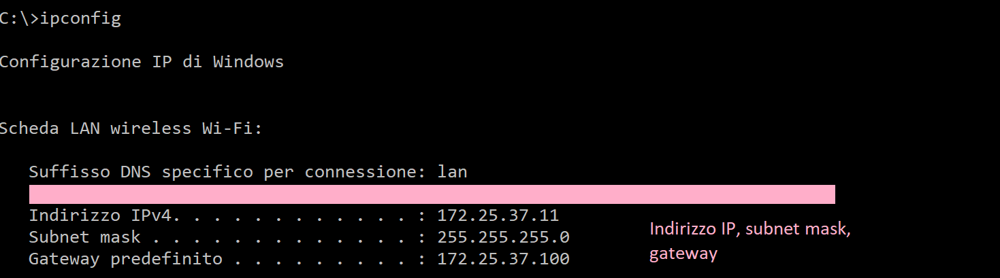
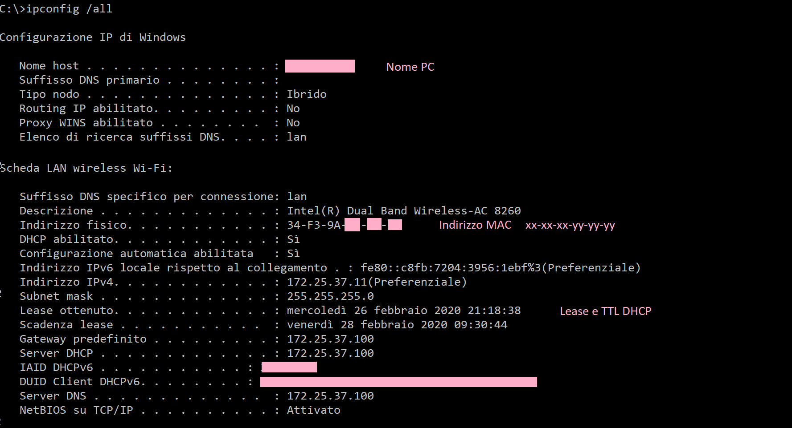

# ipconfig


!!! note "Argomenti teorici e requisiti tecnici"

    Argomenti trattati: **Indirizzamento IP**
    
    Prerequisti: **Windows: command prompt**


`Ipconfig` è il comando basilare fra i vari tool di rete presenti sui sistemi Microsoft, 
perché è quello che permette di verificare la configurazione delle interfacce di rete presenti nel dispositivo.

È utilizzabile dal prompt dei comandi per due ordini di motivi: 

- la **diagnostica** ovvero il controllo delle configurazioni di rete attualmente impostate (IP, subnet, gateway, DNS, MAC, TTL DHCP, etc...).
- il **reset** delle impostazioni, la invocazione del client DHCP, la pulizia della cache DNS, etc...

Vediamo la sintassi generale:

``` bash
$ ipconfig [opzioni] [interfaccia]
```

E le opzioni degne di nota:

| Opzione       | Significato                                                                  |
|---------------|------------------------------------------------------------------------------|
| /all          | Visualizza le informazioni complete su tutte le NIC installate nel sistema   |
| /release      | Rilascia la configurazione di rete della NIC specificata                     |
| /renew        | Rinnova la configurazione di rete della NIC specificata                      |
| /flushdns     | Ripulisce la cache DNS                                                       |
| /registerdns  | Aggiorna i lease DHCP e registra i nomi DNS                                  |


Vediamo un esecuzione del comando ipconfig senza alcuna opzione.



Come si vede, tramite questo comando è possibile visualizzare le informazioni di base di configurazione della rete. 
Per accedere a informazioni più dettagliate dobbiamo utilizzare l'opzione `/all`:



Le altre 4 opzioni vanno a coppia e per l'esecuzione richiedono privilegi amministrativi.

`release` e `renew` servono rispettivamente per cancellare le impostazioni di rete ottenute 
dal server DHCP e per richiedere allo stesso di inviarne di nuove. 
Può essere utile in alcune situazioni se la connettività è limitata perché il pacchetto di risposta
DHCP è arrivato incompleto o corrotto.

``` bash
$ ipconfig /release

... attendi qualche secondo...

$ ipconfig /renew
```

La seconda coppia di opzioni può essere utile quando qualche dispositivo di rete ha cambiato nome e si ha necessità di riaggiornare le
informazioni senza aspettare la scadenza naturale delle stesse tramite il TTL.

``` bash
$ ipconfig /flushdns

... attendi qualche secondo...

$ ipconfig /registerdns
```

Ecco tutto! <br>
Adesso siete dei mezzi draghi del comando `ipconfig`!!! :smile:
