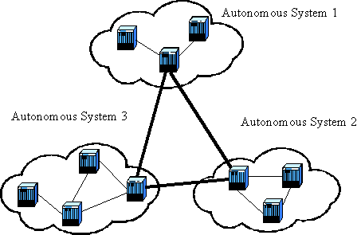

# Il livello di rete

Il livello di rete della suite Internet è probabilmente quello che di
più aderisce negli scopi e nelle funzioni alla strutturazione teorica
stabilita nel modello OSI, che riconduce i compiti principali di questo
livello ai seguenti compiti:

-   l'**indirizzamento**, ovvero la possibilità di distinguere i
    dispositivi tra loro e di raggrupparli opportunamente.
-   L'**impacchettamento**, ovvero la preparazione dei pacchetti adatti
    ad essere trasferiti nella rete Internet per andare dal mittente al
    destinatario (adesso che con l'indirizzamento può distinguerli).
-   L'**instradamento**, ovvero la scelta del percorso che un generico
    pacchetto dati deve compiere per andare dal mittente al
    destinatario.
-   La **gestione delle congestioni**, che durante l'instradamento
    possono verificarsi se troppi pacchetti sono indirizzati verso un
    unico percorso di rete, eventualmente troppo trafficato.

Andando avanti nella trattazione cercheremo di capire chi si occupa di
quale compito e possibilmente perché il livello di rete è organizzato in
questo modo! Prima però... vediamo un po\' di terminologia,
indispensabile per capire i concetti a cui faremo riferimento.

Quando un dispositivo che accede alla rete acquisisce un indirizzo di
rete, tramite il quale può essere identificato univocamente, esso prende
il nome di **host**.

Mittente e destinatario e tutti i dispositivi che lavorano a livello di
rete sono dunque sicuramente degli host.

La scelta del percorso da compiere, l'instradamento o **routing**, viene
fatto tramite appositi dispositivi di rete, collegati a più reti
contemporaneamente. Questi dispositivi, che realizzano fisicamente
l'operazione di instradamento vengono definiti ***router***. Per
decidere il percorso da assegnare ad ogni pacchetto in transito su di
essi consultano una speciale *tabella delle destinazioni*, definita
appunto **tabella di routing**.

I router possono essere dispositivi hardware espressamente dedicati a
tali operazioni, oppure semplici pc con più schede di rete installate.

## Caratteristiche del livello di rete della suite Internet

A livello di rete distinguiamo 2 caratteristiche che ci permettono di
classificare i servizi offerti. Le caratteristiche sono:

1.  ***Connessione:*** Un servizio si dice connesso (a livello di
    rete) quando si preoccupa di stabilire un percorso con il
    destinatario preventivo all\'invio reale dei dati. Prima si
    stabilisce un percorso dal mittente al destinatario, poi si inviano
    tutti i pacchetti sempre in quella direzione.

    Viceversa, un servizio non connesso a livello di rete deve calcolare
    il tragitto per ogni pacchetto inviato.

2.  ***Affidabilità***: Un servizio si dice affidabile (a livello di rete)
    quando ogni nodo del percorso si preoccupa di avvisare il nodo
    precedente se un pacchetto gli è arrivato da esso.

    Viceversa un servizio non affidabile a livello di rete non avvisa
    nessuna per ogni pacchetto ricevuto o no in attraversamento sui
    nodi.

Mettiamo subito un punto in chiaro: tutti i protocolli di rete della
Suite Internet non sono né connessi, né affidabili: i dati da
trasportare sono suddivisi in pacchetti definiti ***datagrammi***,
contenenti ognuno l'indirizzo del destinatario e il livello di rete
sceglie per ognuno un percorso, potenzialmente un percorso diverso per
ogni pacchetto.

Se volete un esempio di protocollo di rete connesso dovete pensare a
quello della vecchia telefonia mobile. Grande qualità per un certo tipo
di dati (le telefonate da telefono fisso nel 1920 funzionavano meglio
delle telefonate con *WhatsApp* nel 2020) ma poca flessibilità per il
grande numero di dati presenti in una rete come la rete Internet. Oltre
alla naturale gestione dei problemi insita in una struttura non connessa
(ogni volta si ricalcola la strada, se una non c'è più se ne sceglie
un'altra. Nei protocolli connessi finché va tutto bene ok, ma se va
male...).

Se volete un esempio di protocollo di rete affidabile... confesso. Non
lo so. Mi sembra veramente un livello di controllo assurdo per
comunicazioni "veloci".

## Il Protocollo IPv4

Il protocollo IP è stato determinato nel 1981 (la preistoria
praticamente) tramite l'[**RFC
791**](https://tools.ietf.org/html/rfc791) ed è il protocollo
fondamentale della rete Internet dal punto di vista del funzionamento
della stessa.

È il protocollo che si occupa dell'identificazione dei dispositivi
tramite il suo ***indirizzamento*** (appunto l'indirizzamento IPv4, di
cui studiamo a parte), questo significa che deve essere eseguito nel
100% dei dispositivi che vogliono utilizzare la rete Internet (l'unico
protocollo a presentare questa caratteristica).

È il protocollo che funge da interfaccia verso il livello di trasporto e
questo significa che è il primo protocollo di rete ad essere utilizzato
ed è dunque quello che si occupa dell'***impacchettamento***: riceve i
dati dal livello di trasporto e li prepara in pacchetti di rete definiti
**datagrammi**.

Avrete già notato che il protocollo IPv4 si occupa da solo di ben 2
compiti (su 4) di tutto il livello di rete. Beh... non è finita.

IPv4 È un protocollo **instradabile**, ovvero i pacchetti che esso crea,
i datagrammi, sono adatti per essere usati così come sono per le
operazioni di routing: questo significa che nessuno dei protocolli del
livello di rete modificherà più la struttura del pacchetto, ma
semplicemente inserirà o modificherà le informazioni necessarie per i
suoi scopi nell'header IP.

**È un protocollo non connesso e non affidabile: **ogni datagramma IP
(così si chiamano i suoi pacchetti) diretto verso una stessa
destinazione può seguire percorsi diversi, arrivare in ordine sparso o
addirittura non arrivare affatto!

La consegna non è garantita, ma il protocollo IP non se ne preoccupa: i
controlli di affidabilità della suite Internet sono eventualmente
affidati al livello di trasporto.

Il protocollo IP agisce da quando il dispositivo è acceso, tramite
l'indirizzamento. Quando il livello di trasporto gli invia dati da
elaborare, prima di tutto si occupa dell'impacchettamento e poi opera lo
smistamento secondo la seguente **logica di base del protocollo IP.**

Esso confronta l\'indirizzo IP del mittente del pacchetto con quello del
destinatario e si comporta secondo le seguenti regole:

-   Se l\'indirizzo IP del mittente è uguale all\'IP del destinatario,
    oppure uno degli indirizzi è della classe 127, il pacchetto viene
    passato al livello superiore (tecnica del **loopback**).
-   Se il destinatario si trova sullo stesso segmento di rete del
    mittente, il pacchetto viene inviato in maniera diretta,
    individuando il destinatario tramite ARP (un altro protocollo di
    rete, che vedremo fra breve).
-   Se il destinatario NON si trova nella stessa rete del mittente, si
    invia il pacchetto al **default gateway**.

Per inviare i pacchetti nella rete, il protocollo IP può utilizzare una
delle seguenti modalità:

-   ***Unicasting***: è il caso più comune. Un pacchetto destinato ad un
    solo computer viene infatti definito unicast, quindi concettualmente
    una trasmissione unicasting corrisponde ad una trasmissione
    punto-a-punto. Si verifica quando l'indirizzo del destinatario è un
    indirizzo valido.
-   ***Broadcasting***: indica la spedizione di un generico pacchetto ad
    un indirizzo particolare che permetterà di consegnarlo a tutti i
    dispositivi collegati a quel segmento di rete. Si verifica quando
    l'indirizzo del destinatario è un indirizzo di broadcast.
-   ***Multicasting***: si intende la trasmissione contemporanea di
    frame ad un gruppo di dispositivi che hanno espresso interesse a
    riceverla. Il tipico esempio è quello delle trasmissioni
    multimediali in streaming. Si verifica quando l'indirizzo del
    destinatario è di classe D.

Vediamo l'intestazione (***header***) del datagramma IP:

+------------------------+------------------+----------+------------------+----------+
| 0 --- 3                | 4 -- 7           | 8 -- 15  | 16 -- 18         | 19 -- 31 |
+------------------------+------------------+----------+------------------+----------+
| 0100                   | Lunghezza Header | Servizio | Lunghezza Totale |          |
+------------------------+------------------+----------+------------------+----------+
| Identificazione        | flags            | Offset   |                  |          |
+------------------------+------------------+----------+------------------+----------+
| TTL                    | Protocollo       | CRC      |                  |          |
+------------------------+------------------+----------+------------------+----------+
| Indirizzo Mittente     |                  |          |                  |          |
+------------------------+------------------+----------+------------------+----------+
| Indirizzo Destinatario |                  |          |                  |          |
+------------------------+------------------+----------+------------------+----------+
| Campi opzionali        |                  |          |                  |          |
+------------------------+------------------+----------+------------------+----------+
| DATI                   |                  |          |                  |          |
|                        |                  |          |                  |          |
| (body del pacchetto)   |                  |          |                  |          |
|                        |                  |          |                  |          |
| . . .                  |                  |          |                  |          |
+------------------------+------------------+----------+------------------+----------+

Ok tranquilli... non si tratta di impararlo a memoria o riprodurlo
uguale durante le interrogazioni! Volevo solo mettere in evidenza alcune
informazioni che l'intestazione del datagramma IP si porta con sé,
quelle che ho messo in grassetto:

-   **0100**, il pacchetto IPv4 inizia con 4 in binario.
-   **lunghezza totale**, numero di byte che compongono il pacchetto.
    Sono 16 bit, quindi\...
-   **TTL**, contatore della vita del pacchetto (Time To Live). Inizia
    da 30 o da 15 e scala di 1 ogni volta che si attraversa un router.
    Se arriva a zero, il pacchetto viene eliminato.
-   **CRC**, campo di controllo. Serve a verificare se il pacchetto è
    arrivato corrotto o no.
-   **indirizzi mittente e destinatario**, IP mittente e destinatario
-   **dati**, dati trasportati dal frame IP.

## Protocollo ARP

ARP (Address Resolution Protocol) è un protocollo "storico" delle reti,
implementato nel 1982 tramite l'[**RFC
826**](https://tools.ietf.org/html/rfc826), rappresenta uno strumento
indispensabile del protocollo di rete e grazie anche al suo opposto RARP
(Reverse ARP) si pone come strumento di collegamento fra il livello di
rete e quello inferiore.

Per essere spedito infatti, un pacchetto IP deve essere passato al
livello inferiore che avrà il compito di individuare fisicamente il
dispositivo del destinatario e di trasformare in segnali fisici i dati
logici contenuti nei pacchetti IP. La procedura di individuazione fisica
del destinatario si risolve tramite il protocollo ARP, che è in grado di
abbinare ad ogni indirizzo logico (un indirizzo IP) un indirizzo fisico
(un **indirizzo MAC**) che identifica univocamente un dispositivo.

L\'indirizzo MAC, o indirizzo fisico, è un identificatore univoco per
una NIC (Network Interface Card, una scheda di rete). Questo significa
che ogni scheda di rete prodotta sulla Terra possiede un indirizzo MAC
diverso e che questo permette di tracciare il costruttore, il pezzo
prodotto e in molti casi persino l'acquirente (da parte della ditta
produttrice).

L'indirizzo MAC é formato da 6 coppie di cifre esadecimali, indicate di
solito con due punti che li separano, ad esempio: 00:C0:9F:3C:C0:20

Delle 6 coppie le prime 3 (in questo caso 00:C0:9F) identificano la
ditta produttrice, mentre le 3 rimanenti identificano il "pezzo" nel
lotto di produzione.

Questa identificazione così vincolante (conoscere l'indirizzo MAC di un
dispositivo... è tanta roba!) può avvenire solo in una rete locale,
infatti ARP manda in broadcast una richiesta del tipo:

*W*ho has 192.168.0.13? Tell 192.168.0.10

Tutti i dispositivi della rete locale riceverano la richiesta ma solo
uno avrà quell'indirizzo IP e risponderà (in unicast, all'indirizzo
indicato) con il suo indirizzo MAC

192.168.0.13 is at 01:02:03:04:05:06

A questo punto, colui che ha fatto la richiesta (il dispositivo con
indirizzo 192.168.0.10 nel nostro esempio) inserirà nella sua cache ARP
la coppia indirizzo IP / indirizzo MAC. In questo modo non avrà bisogno
di richiedere ogni volta l'intervento del protocollo ARP per risolvere
un indirizzo.

Allo stesso modo però, per permettere cambiamenti nella configurazione
della rete, ad ogni voce nella cache viene assegnata un TTL (Time To
Live), un tempo oltre il quale la voce viene cancellata.

Il TTL di default dura 2 minuti. Ogni volta che avviene traffico fra le
due stazioni il TTL si resetta a 2 minuti. Oltre 10 minuti la voce in
cache viene comunque eliminata.

## Routing

Se dobbiamo occuparci di routing, significa che siamo già... in viaggio!
Infatti il routing, l'instradamento, la scelta del percorso va
effettuata per tutti quei pacchetti che secondo la logica di base del
protocollo IP sono stati inviati al default gateway, ovvero il primo
dispositivo in grado di fare routing e che si occupa di gestire quei
pacchetti il cui indirizzo di destinazione appartiene ad una rete
diversa da quella dell'indirizzo del mittente.

Lasciatemi dire che il routing è praticamente quell'arte magica che
riesce ad indirizzare ogni pacchetto verso la sua destinazione.

Magia, non c'è un altro termine. Noi proveremo però a capire il
*trucco*...

Intanto diciamo che il routing rappresenta il "grosso" del lavoro nel
trasferimento di un pacchetto dal mittente A al destinatario B. Per
spiegare questo concetto possiamo prendere ad esempio la trasmissione di
una lettera. Il mittente la scrive, la indirizza e la spedisce,
mettendola in una cassetta della posta. Al massimo il mittente avrà
dunque contatti col postino incaricato di raccogliere la posta da quella
cassetta. Tutto il trasferimento organizzato dalle poste (camion, treno,
aereo, etc.) non lo coinvolge assolutamente. Il destinatario si trova la
lettera nella propria cassetta della posta. E anche qui, al massimo egli
avrà rapporti col postino (in motorino) incaricato di consegnargliela.

Capito più o meno cosa si intende per routing adesso vogliamo capire:
chi se ne occupa? E come? Fisicamente il routing viene effettuato dai
router, i dispositivi del livello di rete che organizzano la rete
stessa. E come fanno? Ci riescono grazie a due concetti fondamentali, di
cui parleremo dalla prossima pagina:

-   il routing gerarchico
-   le tabelle di routing

### Routing gerarchico

Considerando il numero incredibile di reti diverse presenti su internet
con IPv4 (oltre 2 milioni di reti), come è possibile realizzare questa
incredibile magia della tecnologia, del pensiero e dell'informatica che
è l'instradamento globale?

La risposta sta nell'organizzazione imposta alla rete da **ICANN** (vi
ricordate questa società?). Questa organizzazione ha strutturato
Internet in maniera gerarchica tramite l'assegnazione delle reti IP agli
ISP (Internet Service Provider).

Gli ISP organizzano il territorio ove si estende la propria rete e ove
sono situati i loro clienti in maniera autonoma. ICANN definisce queste
entità amministrative locali come **Sistemi Autonomi** (AS), ovvero
gruppi di router e reti sotto il controllo di una singola e ben definita
autorità amministrativa.

Ogni Sistema Autonomo sulla rete Internet è identificato da un numero a 16 bit (**ASN, AS number**).

Il routing realizzabile grazie a questi AS si definisce ***routing
gerarchico*** ed avviene su 2 diversi livelli:

1.  **Routing Interno al Sistema Autonomo**, in cui si utilizzano
    protocolli di tipo **IGP** (Interior Gateway Protocol): ogni AS può
    scegliere quello che preferisce.
2.  **Di collegamento tra Sistemi Autonomi, ** in cui si utilizza un
    unico protocollo di tipo **EGP** (Exterior Gateway Protocol): non
    voglio togliervi la suspence e anticiparvi il nome\...

Ipotizziamo ad esempio di voler inviare un pacchetto dall'Italia agli
Stati Uniti, che appartengono ovviamente a Sistemi Autonomi diversi; il
pacchetto viene inviato procedendo secondo i seguenti livelli di
routing:

1.  routing interno al sistema autonomo dove si trova il mittente (molto
    più ristretto di un routing globale)
2.  routing esterno ai sistemi autonomi (eseguito considerando gli AS
    come punti della mappa), per portare il pacchetto dall'AS del
    mittente a quello del destinatario.
3.  routing interno al sistema autonomo del destinatario

Il pacchetto che è partito dal nostro dispositivo in Italia e di cui
attualmente sappiamo solo aver raggiunto il default Gateway verrà
analizzato dal primo router in cui capita che si domanderà
semplicemente: l'IP del destinatario è in una rete che conosco? (ovvero
è all'interno del mio AS?) No. Allora lo mando verso l'esterno del
Sistema Autonomo.

Arrivato all'esterno del sistema autonomo, i router analizzeranno il
pacchetto guardando il suo indirizzo di destinazione e si chiederanno:
In quale AS si trova questo indirizzo? Portiamolo lì.

Arrivato nel Sistema Autonomo del destinatario, lì dovranno sapere
precisamente come raggiungere la rete di appartenenza dell'IP del
destinatario. Arrivati ad un dispositivo della stessa si potrà procedere
al mittente vero e proprio individuandolo ancora tramite ARP.

Non è facile, è quasi magia. Ma è la modalità più semplice in cui sono
riuscito a spiegarlo. La prossima lezione accanitevi nelle domande :)

### Tabelle di Routing

Quando un pacchetto arriva su un router, questo consulta una tabella per
capire dove indirizzarlo per il prossimo "salto". E poi ce lo spedisce.
Semplice e veloce. Il routing, ovvero la scelta del percorso da
effettuare (o almeno del prossimo "pezzo" del percorso) si fa
consultando le tabelle di routing. I protocolli di routing intervengono
per la creazione delle tabelle di routing, non per il routing vero e
proprio!

Ogni spostamento da un router ad un altro viene definito ***salto***, un
***hop. ***Ogni salto diminuisce (di uno) il TTL di un pacchetto.

Una ***tabella di routing*** è costituita da almeno 3 campi:

-   l'identificativo della rete di destinazione (tipicamente, un network
    address)
-   la Subnet Mask utilizzata per definire la rete di destinazione
-   il gateway per la destinazione finale (next hop)

Vediamo un esempio:

  --------------- --------------- -----------------
  Network         Mask            Gateway
  100.0.0.0       255.0.0.0       100.100.1.75
  170.50.0.0      255.255.0.0     200.200.2.150
  200.150.100.0   255.255.255.0   150.150.150.150
  --------------- --------------- -----------------

Ricapitolando: un pacchetto arriva su un router con la tabella di
routing qui sopra.

Si diminuisce di 1 il suo TTL e lo si controlla: se è zero, il pacchetto
viene eliminato.

Si controlla il suo indirizzo IP di destinazione per cercare di capire
verso quale destinazione inviarlo. La tabella si legge dalla prima
all'ultima riga (l'ordine è fondamentale). La prima riga che soddisfa il
pacchetto viene utilizzata. Se nessuna riga coincide con la sua
destinazione, il pacchetto viene eliminato.

Per determinare la destinazione di un pacchetto si prende la prima riga
e si applica la subnet mask all'indirizzo di destinazione del pacchetto.
Si ottiene un indirizzo di rete. Se questo coincide con l'indirizzo di
rete indicato nella prima riga si procede all'invio verso il gateway
corrispondente. Altrimenti si procede alla riga successiva. Come dicevo
prima, se finiscono le righe senza trovare una destinazione si elimina
il pacchetto.

Come si mettono d'accordo i due concetti principali che abbiamo appena
illustrato, ovvero ***routing gerarchico*** e ***tabelle di routing***?

Proverò ancora a spiegare la questione con un esempio. Immaginate che un
AS gestisca al suo interno 5 reti come nella figura sotto. Tutto il
resto è considerato esterno al Sistema Autonomo. Allora la tabella di
routing del router indicato come R1 sarà così:

  ---------- ----------- -----------
  Network    Mask        Gateway
  11.0.0.0   255.0.0.0   11.10.9.8
  12.0.0.0   255.0.0.0   12.3.4.5
  13.0.0.0   255.0.0.0   13.4.5.6
  14.0.0.0   255.0.0.0   11.10.9.8
  15.0.0.0   255.0.0.0   12.3.4.5
  0.0.0.0    0.0.0.0     7.4.7.4
  ---------- ----------- -----------

Se il pacchetto è destinato ad una delle reti elencate nelle prime 5
righe utilizza il gateway indicato. Altrimenti viene indirizzato
dall'ultima riga (qualunque indirizzo a cui viene applicata la maschera
0.0.0.0 diventa 0.0.0.0) verso il gateway 7.4.7.4 ovvero sparato in
uscita dal Sistema Autonomo.

### Algoritmi di routing

Gli algoritmi utilizzati per il routing dinamico si dividono in due categorie:

+-----------------+---------------------------------------------------+
| Algoritmi       | Basati sul ***vettore delle distanze***.          |
|                 |                                                   |
| DISTANCE-VECTOR | Utilizzano l'algoritmo ***Bellman-Ford***.        |
|                 |                                                   |
|                 | Calcolano la distanza dai router vicini secondo   |
|                 | una metrica e la comunicano a ognuno di essi; man |
|                 | mano che le informazioni si divulgano, i router   |
|                 | calcolano la distanza con i nuovi router che      |
|                 | prima non conoscevano e si crea tutta la tabella  |
|                 | di routing.                                       |
+-----------------+---------------------------------------------------+
| Algoritmi       | Basati sullo ***stato del collegamento***.        |
|                 |                                                   |
| LINK-STATE      | Utilizzano l'algoritmo di ***Dijkstra****.***     |
|                 |                                                   |
|                 | Tutti i nodi si scambiano informazioni sul costo  |
|                 | dei collegamenti coi vicini tramite multicast.    |
|                 | Quando ogni nodo ha ricevuto tutte le             |
|                 | informazioni, usa l'algoritmo per determinare il  |
|                 | cammino minimo per raggiungere ogni nodo, ponendo |
|                 | se stesso come radice dell\'albero dei cammini    |
|                 | minimi.                                           |
+-----------------+---------------------------------------------------+

### Il protocollo RIP

RIP (Routing Information Protocol) è un protocollo IGP di tipo
***distance-vector*** pubblicato nel 1988 con l'[**RFC
1058**](https://tools.ietf.org/html/rfc1058) e revisionato con
terrificante regolarità negli anni successivi; ha avuto una grandissima
diffusione fino a quando non e stato messo a punto OSPF, protocollo di
tipo link-state, standard attuale per il routing fra gateway interni.

RIP impiega il conteggio dei numeri di salti (hop count) come metrica di
routing. Il massimo numero di hop permessi è 15. Ogni router RIP
trasmette di default, ogni 30 secondi, la propria tabella completa di
routing a tutti i vicini direttamente collegati, generando grande
traffico dati, spesso inutile per la staticità di molte reti

### Il protocollo OSPF

OSPF (Open Shortest Path First) è un protocollo IGP di tipo
***link-state*** basato su uno standard aperto (OSPF 2.0, [**RFC
2178**](https://tools.ietf.org/html/rfc2178), anno 1997) che è in grado
di adattarsi velocemente ai cambiamenti di topologia e supportare vari
tipi di metriche, ad un costo però non nullo per la rete.

Le informazioni di modifica dello "stato del collegamento" vengono
inviate in multicast a tutti i router della rete gestita tramite esso,
aggiornando (continuamente) lo stato complessivo della rete.

### Il protocollo BGP

BGP (Border Gateway Protocol) è *il* protocollo EGP di tipo
***distance-vector*** che agisce nel "cuore" di Internet, la cui prima
versione ufficiale è datata 1990, con l'[**RFC
1267**](https://tools.ietf.org/html/rfc1267).

Viene utilizzato per scambiare informazioni fra i router che
appartengono a sistemi autonomi distinti (i cosiddetti ***gateway
routers***) da cui il nome del protocollo.

Si tratta di un protocollo di routing ad indicazione di percorso che non
si basa su metriche o algoritmi tecnici per l'indicazione del percorso,
ma agisce basandosi su regole specifiche definite su ciascun sistema
autonomo da accordi politici fra i vari "proprietari" (o forse dovevo
scrivere "gestori"?) dei sistemi autonomi.

