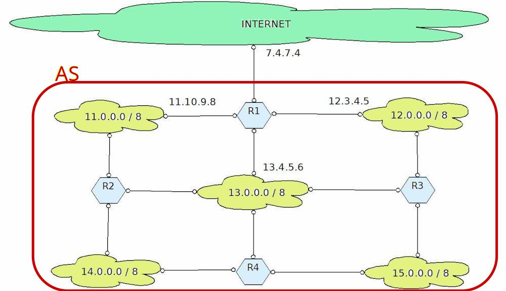

# Routing

Se dobbiamo occuparci di routing, significa che siamo già... in viaggio!
Infatti il routing, l'instradamento, la scelta del percorso va
effettuata per tutti quei pacchetti che secondo la logica di base del
protocollo IP sono stati inviati al default gateway, ovvero il primo
dispositivo in grado di fare routing e che si occupa di gestire quei
pacchetti il cui indirizzo di destinazione appartiene ad una rete
diversa da quella dell'indirizzo del mittente.

Lasciatemi dire che il routing è praticamente quell'arte magica che
riesce ad indirizzare ogni pacchetto verso la sua destinazione.

Magia, non c'è un altro termine. Noi proveremo però a capire il
*trucco*...

Intanto diciamo che il routing rappresenta il "grosso" del lavoro nel
trasferimento di un pacchetto dal mittente A al destinatario B. Per
spiegare questo concetto possiamo prendere ad esempio la trasmissione di
una lettera. Il mittente la scrive, la indirizza e la spedisce,
mettendola in una cassetta della posta. Al massimo il mittente avrà
dunque contatti col postino incaricato di raccogliere la posta da quella
cassetta. Tutto il trasferimento organizzato dalle poste (camion, treno,
aereo, etc.) non lo coinvolge assolutamente. Il destinatario si trova la
lettera nella propria cassetta della posta. E anche qui, al massimo egli
avrà rapporti col postino (in motorino) incaricato di consegnargliela.

Capito più o meno cosa si intende per routing adesso vogliamo capire:
chi se ne occupa? E come? Fisicamente il routing viene effettuato dai
router, i dispositivi del livello di rete che organizzano la rete
stessa. E come fanno? Ci riescono grazie a due concetti fondamentali, di
cui parleremo a breve:

- il routing gerarchico
- le tabelle di routing

## Routing gerarchico

Considerando il numero incredibile di reti diverse presenti su internet
con IPv4 (oltre 2 milioni di reti), come è possibile realizzare questa
incredibile magia della tecnologia, del pensiero e dell'informatica che
è l'instradamento globale?

{style="float:right; margin: 10px"}

La risposta sta nell'organizzazione imposta alla rete da **ICANN**. 
Questa organizzazione ha strutturato
Internet in maniera gerarchica tramite l'assegnazione delle reti IP agli
ISP (Internet Service Provider).

Gli ISP organizzano il territorio ove si estende la propria rete e ove
sono situati i loro clienti in maniera autonoma. ICANN definisce queste
entità amministrative locali come **Sistemi Autonomi** (AS), ovvero
gruppi di router e reti sotto il controllo di una singola e ben definita
autorità amministrativa.

Ogni Sistema Autonomo sulla rete Internet è identificato da un numero a 16 bit (**ASN, AS number**).

Il routing realizzabile grazie a questi AS si definisce ***routing gerarchico*** ed avviene su 2 diversi livelli:

1.  **Routing Interno al Sistema Autonomo**, in cui si utilizzano
    protocolli di tipo **IGP** (Interior Gateway Protocol): ogni AS può
    scegliere quello che preferisce.
2.  **Di collegamento tra Sistemi Autonomi**, in cui si utilizza un
    unico protocollo di tipo **EGP** (Exterior Gateway Protocol): non
    voglio togliervi la suspence e anticiparvi il nome...

Ipotizziamo ad esempio di voler inviare un pacchetto dall'Italia agli
Stati Uniti, che appartengono ovviamente a Sistemi Autonomi diversi; il
pacchetto viene inviato procedendo secondo i seguenti livelli di
routing:

1.  routing interno al sistema autonomo dove si trova il mittente (molto
    più ristretto di un routing globale)
2.  routing esterno ai sistemi autonomi (eseguito considerando gli AS
    come punti della mappa), per portare il pacchetto dall'AS del
    mittente a quello del destinatario.
3.  routing interno al sistema autonomo del destinatario

Il pacchetto che è partito dal nostro dispositivo in Italia e di cui
attualmente sappiamo solo aver raggiunto il default Gateway verrà
analizzato dal primo router in cui capita che si domanderà
semplicemente: l'IP del destinatario è in una rete che conosco? (ovvero
è all'interno del mio AS?) No. Allora lo mando verso l'esterno del
Sistema Autonomo.

Arrivato all'esterno del sistema autonomo, i router analizzeranno il
pacchetto guardando il suo indirizzo di destinazione e si chiederanno:
In quale AS si trova questo indirizzo? Portiamolo lì.

Arrivato nel Sistema Autonomo del destinatario, lì dovranno sapere
precisamente come raggiungere la rete di appartenenza dell'IP del
destinatario. Arrivati ad un dispositivo della stessa si potrà procedere
al mittente vero e proprio individuandolo ancora tramite ARP.

Non è facile, è quasi magia. Ma è la modalità più semplice in cui sono
riuscito a spiegarlo. La prossima lezione accanitevi nelle domande :)

## Tabelle di Routing

Quando un pacchetto arriva su un router, questo consulta una tabella per
capire dove indirizzarlo per il prossimo "salto". E poi ce lo spedisce.
Semplice e veloce. Il routing, ovvero la scelta del percorso da
effettuare (o almeno del prossimo "pezzo" del percorso) si fa
consultando le tabelle di routing. I protocolli di routing intervengono
per la creazione delle tabelle di routing, non per il routing vero e
proprio!

Ogni spostamento da un router ad un altro viene definito ***salto***, un
***hop. ***Ogni salto diminuisce (di uno) il TTL (Time To Live) di un pacchetto.

Una ***tabella di routing*** è costituita da almeno 3 campi:

- l'identificativo della rete di destinazione (tipicamente, un network address)
- la Subnet Mask utilizzata per definire la rete di destinazione
- il gateway per la destinazione finale (next hop)

Vediamo un esempio:

| Network        | Mask          | Gateway         |
|---------------:|--------------:|----------------:|
| 100.0.0.0      | 255.0.0.0     | 100.100.1.75    |
| 170.50.0.0     | 255.255.0.0   | 200.200.2.150   |
| 200.150.100.0  | 255.255.255.0 | 150.150.150.150 |

Ricapitolando: un pacchetto arriva su un router con la tabella di routing qui sopra.

Si diminuisce di 1 il suo TTL e lo si controlla: se è zero, il pacchetto viene eliminato.

Si controlla il suo indirizzo IP di destinazione per cercare di capire
verso quale destinazione inviarlo. La tabella si legge dalla prima
all'ultima riga (l'ordine è fondamentale). La prima riga che soddisfa il
pacchetto viene utilizzata. Se nessuna riga coincide con la sua
destinazione, il pacchetto viene eliminato.

Per determinare la destinazione di un pacchetto si prende la prima riga
e si applica la subnet mask all'indirizzo di destinazione del pacchetto.
Si ottiene un indirizzo di rete. Se questo coincide con l'indirizzo di
rete indicato nella prima riga si procede all'invio verso il gateway
corrispondente. Altrimenti si procede alla riga successiva. Come dicevo
prima, se finiscono le righe senza trovare una destinazione si elimina
il pacchetto.

Come si mettono d'accordo i due concetti principali che abbiamo appena
illustrato, ovvero ***routing gerarchico*** e ***tabelle di routing***?

Proverò ancora a spiegare la questione con un esempio. Immaginate che un
AS gestisca al suo interno 5 reti come nella figura sotto. Tutto il
resto è considerato esterno al Sistema Autonomo. 

{style="width:100%"}

Allora la tabella di routing del router indicato come R1 sarà così:

| Network    | Mask       | Gateway    |
|-----------:|-----------:|-----------:|
| 11.0.0.0   | 255.0.0.0  | 11.10.9.8  |
| 12.0.0.0   | 255.0.0.0  | 12.3.4.5   |
| 13.0.0.0   | 255.0.0.0  | 13.4.5.6   |
| 14.0.0.0   | 255.0.0.0  | 11.10.9.8  |
| 15.0.0.0   | 255.0.0.0  | 12.3.4.5   |
| 0.0.0.0    | 0.0.0.0    | 7.4.7.4    |

Se il pacchetto è destinato ad una delle reti elencate nelle prime 5
righe utilizza il gateway indicato. Altrimenti viene indirizzato
dall'ultima riga (qualunque indirizzo a cui viene applicata la maschera
0.0.0.0 diventa 0.0.0.0) verso il gateway 7.4.7.4 ovvero sparato in
uscita dal Sistema Autonomo.

## Algoritmi di routing

Gli algoritmi utilizzati per il routing dinamico si dividono in due categorie:

---

**Algoritmi DISTANCE-VECTOR** 
Basati sul ***vettore delle distanze***. 
Utilizzano l'algoritmo ***Bellman-Ford***. 
Calcolano la distanza dai router vicini secondo una metrica e la comunicano a ognuno di essi; man
mano che le informazioni si divulgano, i router calcolano la distanza con i nuovi router che
prima non conoscevano e si crea tutta la tabella di routing.

---

**Algoritmi LINK-STATE** 
Basati sullo ***stato del collegamento***. 
Utilizzano l'algoritmo di ***Dijkstra***. 
Tutti i nodi si scambiano informazioni sul costo dei collegamenti coi vicini tramite multicast.
Quando ogni nodo ha ricevuto tutte le informazioni, usa l'algoritmo per determinare il 
cammino minimo per raggiungere ogni nodo, ponendo se stesso come radice dell'albero dei cammini
minimi.

 

**Il protocollo RIP**

RIP (Routing Information Protocol) è un protocollo IGP di tipo
***distance-vector*** pubblicato nel 1988 con l'[**RFC 1058**](https://tools.ietf.org/html/rfc1058) e revisionato con
terrificante regolarità negli anni successivi; ha avuto una grandissima
diffusione fino a quando non e stato messo a punto OSPF, protocollo di
tipo link-state, standard attuale per il routing fra gateway interni.

RIP impiega il conteggio dei numeri di salti (hop count) come metrica di
routing. Il massimo numero di hop permessi è 15. Ogni router RIP
trasmette di default, ogni 30 secondi, la propria tabella completa di
routing a tutti i vicini direttamente collegati, generando grande
traffico dati, spesso inutile per la staticità di molte reti

 

**Il protocollo OSPF**

OSPF (Open Shortest Path First) è un protocollo IGP di tipo
***link-state*** basato su uno standard aperto (OSPF 2.0, [**RFC 2178**](https://tools.ietf.org/html/rfc2178), anno 1997) che è in grado
di adattarsi velocemente ai cambiamenti di topologia e supportare vari
tipi di metriche, ad un costo però non nullo per la rete.

Le informazioni di modifica dello "stato del collegamento" vengono
inviate in multicast a tutti i router della rete gestita tramite esso,
aggiornando (continuamente) lo stato complessivo della rete.

 

**Il protocollo BGP**

BGP (Border Gateway Protocol) è *il* protocollo EGP di tipo
***distance-vector*** che agisce nel "cuore" di Internet, la cui prima
versione ufficiale è datata 1990, con l'[**RFC 1267**](https://tools.ietf.org/html/rfc1267).

Viene utilizzato per scambiare informazioni fra i router che
appartengono a sistemi autonomi distinti (i cosiddetti ***gateway
routers***) da cui il nome del protocollo.

Si tratta di un protocollo di routing ad indicazione di percorso che non
si basa su metriche o algoritmi tecnici per l'indicazione del percorso,
ma agisce basandosi su regole specifiche definite su ciascun sistema
autonomo da accordi politici fra i vari "proprietari" (o forse dovevo
scrivere "gestori"?) dei sistemi autonomi.

 
 

