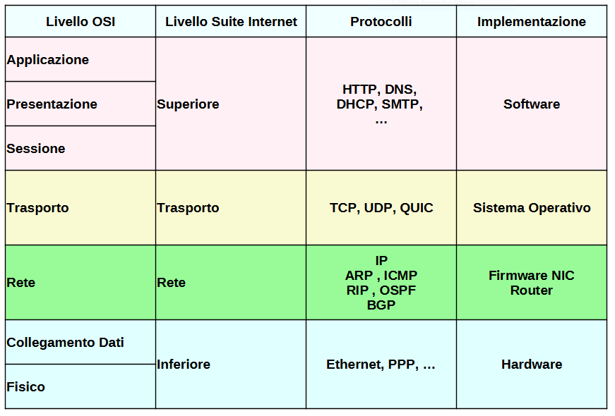

# La Suite Internet

La `Internet Protocol Suite` è un insieme di protocolli di rete che implementa la pila di protocolli su cui funziona Internet. 

Se la cercate in rete o nella letteratura attuale, la troverete nominata in vari modi: ***Internet Protocol Suite***, o più semplicemente ***Suite Internet***, 
o addirittura con il nomignolo ***TCP/IP***, che deriva dalla grande importanza storica 
dei suoi due protocolli più rappresentativi: TCP e IP.

!!! note "Protocolli (di rete) e suite(s)"

    Un **_protocollo_** è un insieme di regole utilizzate per favorire la comunicazione tra due o più entità. 
    Ovviamente nel caso specifico di un **_protocollo di rete_**, queste regole andranno a definire le modalità di
    interazioni fra due o più dispositivi.
      
    Uno **_stack (o una suite) di protocolli_** è un insieme di protocolli che collaborano fra loro per ottenere uno scopo comune.

La necessità di implementare realmente i livelli descritti ha portato ad una semplificazione di alcune parti del modello OSI, come si desume dalla figura seguente:

Il livello *superiore*, la cui implementazione è affidata al *software*, si occupa di stabilire le regole che permettono ai dati utente di essere trasportati
in maniera organizzata: si passa quindi dai *dati* (chat, siti web, files, etc...) ai *blocchi*, insiemi organizzati di dati.

Il livello di *trasporto*, implementato a livello di *Sistema Operativo*, si occupa prevalentemente di individuare il mittente e il destinatario della comunicazione, ovvero
il punto di partenza dei blocchi che arrivano dal livello superiore e il punto ove questi devono arrivare.

Il livello di *rete*, implementato nel *firmware (driver, router, etc)*, si occupa di due compiti fondamentali: preparare i pacchetti dati che saranno inviati, completi delle informazioni arrivate dai livelli precedenti,
e stabilire il percorso che i pacchetti devono compiere per arrivare dal mittente al destinatario.

Infine il livello *inferiore*, implementato a livello *hardware*, si occupa di trasformare i pacchetti logici in segnali fisici.

NOTA: qui ci va un disegnino sul funzionamento della suite: la storia di un pacchetto!!!

Semplice e schematico :smile:
