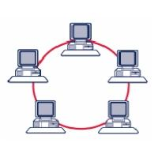
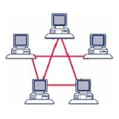

# Suite Internet: Livello Inferiore

Il livello inferiore della suite TCP/IP si occupa essenzialmente delle seguenti operazioni:

- trasformazione dei dati digitali da inviare in frame fisici separati
- controllo degli errori di trasmissione
- controllo di flusso dei dati

Tutte queste operazioni vengono svolte a livello hardware e, come abbiamo già visto, molte delle specifiche in utilizzo nel livello 
sono appannaggio di `IEEE` ([http://www.ieee.org](http://www.ieee.org/)). Questa associazione si preoccupa sostanzialmente di fare 
da punto di incontro fra le esigenze delle aziende che la compongono, il bisogno che spesso hanno di spingere per qualche nuova tecnologia 
e la possibilità per tutti di sviluppare e produrre determinate specifiche hardware.

## Specifiche IEEE 802

Le prime specifiche IEEE che riguardano il livello inferiore sono state pubblicate
nel 1980 dalla commissione denominata ***IEEE 802***, da cui prendono il nome. 

La specifica IEEE 802 non è una specifica chiusa, ma piuttosto in continua evoluzione (ancora oggi, per intenderci), sia per i lavori dei sottogruppi,
sia per l'eventuale aggiunta di nuove parti alla stessa.

Vediamo le specifiche principali:

| Specifica | Descrizione                                      |
|-----------|--------------------------------------------------|
| 802.3     | Ethernet: connettori e cavi di rete              |
| 802.5     | Token Ring: specifica per le reti ad anello      |
| 802.11    | Wireless LAN                                     | 
| 802.15    | Personal Area Network (Bluetooth, IrDA, etc...)  |
| 802.16    | WiMAX                                            |

!!! tip "Fibra Ottica"

    Se cercate la fibra ottica senza trovarla, sappiate che è inserita nella specifica **IEEE 802.3**, a seguito
    di uno dei tanti ampliamenti della stessa!

## Tipologie di rete

In base alla grandezza (geografica) e al raggio d’azione è possibile distinguere diverse dimensioni di rete. 
Tra le più importanti tipologie di rete troviamo:

- Personal Area Network (PAN)
- Local Area Network (LAN)
- Metropolitan Area Network (MAN)
- Wide Area Network (WAN)

Poiché i nomi delle diverse tipologie sono abbastanza autoesplicativi, lascio come compito quello di provare ad elencare i possibili dispositivi
presenti in ognuna delle tipologie elencate e lo scopo che questa si prefigge.

Ogni elemento di una rete viene definito un `Host`; quegli elementi della rete che si occupano dello smistamento dei dati prendono anche il nome di `Nodi` della rete.

Oltre alla classificazione per dimensione, le tipologie di rete sono classificabili anche in base all'architettura di funzionamento.

Per descrivere queste tipologie dobbiamo introdurre due nuovi termini:

- `Server`: componente software presente in un host in grado di rendere disponibile una risorsa.

- `Client`: componente software presente in un host in grado di accedere alla risorse rese disponibili dai server.

Da qui abbiamo due diverse tipologie di rete:

- Rete `Client-Server`: tipologia di rete in cui è presente uno o più server in grado di rendere disponibili le risorse a cui tutti gli altri host (i client) accedono.

- Rete `p2p (Peer-to-Peer)`: tipologia di rete composta da `pari` ossia da dispositivi in cui sono presenti contemporaneamente componenti server e client.

Sembra ovvio notare come le reti Client-Server siano di più semplice organizzazione e tali per cui si possa concentrare gli sforzi e le risorse sui pochi server presenti.
Questo accentramento in uno o pochi host della rete delle risorse rappresenta però anche il punto di debolezza di tali reti. Le reti p2p sono invece naturalmente 
decentralizzate e scalabili, ma offrono poca sicurezza dovuta anche alla esigua capacità di controllo della stessa.

## Topologie di rete 

Studiando una rete qualsiasi (dalla rete Internet alla rete domestica, passando per la rete scolastica o quella di qualsiasi azienda)
incapperemo regolarmente in una serie di dispositivi, organizzati spazialmente e gerarchicamente in una topologia particolare, collegati
da una serie di cablaggi.

Cerchiamo di identificare i "blocchi organizzativi" che potremo trovare
osservando una qualsiasi rete di computer. 

---

**Topologia a bus**

{style="float:left; margin-right:30px"}

Questa topologia è di gran lunga la più semplice e la
più utilizzata in passato. Tutti i dispositivi facenti parte della rete
sono qui connessi ad un'unica dorsale, detta "***backbone***".

In un ambiente bus, solo un dispositivo alla volta può inviare una
informazione, quindi tutti gli utenti di una rete condividono la
quantità disponibile del tempo di transmissione. Inoltre la topologia a
bus è di tipo **passivo**, cioè i suoi dispositivi sono solo in attesa
dei dati spediti, senza essere coinvolti attivamente nel trasferimento.

Se uno qualsiasi dei dispositivi si guasta, questo non ha effetti sulla
rete, ma se si rompe (o si stacca) uno dei cavi in qualunque punto, la
rete diviene completamente inutilizzabile.

---

**Topologia ad anello**

{style="float:left; margin-right:30px"}

Quando ogni dispositivo è connesso direttamente al successivo in linea fino a chiudere un circolo, si parla di topologia ad
anello. In questa topologia, a differenza delle altre, ogni dispositivo ha dunque due cavi collegati. 
Siamo inoltre in presenza di una topologia
attiva, poiché ognuno dei dispositivi è responsabile, quando riceve un
segnale, di elaborarlo oppure rigenerarlo e farlo passare verso il
dispositivo successivo.

In questa topologia si utilizza un protocollo particolare definito
**"token passing"** per la sincronizzazione nell'utilizzo del canale.
Analogamente al gioco del testimone, un piccolo pacchetto, chiamato
token (gettone) passa lungo l'anello a turno su ogni dispositivo. Se
uno di questi deve trasmettere attacca al token una sequenza contenente
indirizzo di partenza (il proprio), indirizzo di arrivo (quello del
destinatario) e una sezione dati. L'informazione viaggia lungo
l'anello finché non raggiunge il destinatario oppure non ritorna dal
mittente (che decide se scartarla o provare un nuovo invio).

Questa topologia è mediamente la più veloce esistente, ma gli elevati
costi di installazione e la sua incredibile fragilità (ogni rottura,
spegnimento o malfunzionamento di computer o cablaggio termina la rete)
ne hanno limitato incredibilmente lo sviluppo su larga scala.

---

**Topologia a stella**

{style="float:left; margin-right:30px"}

La seguente topologia viene considerata la più robusta,
fra quelle esistenti e questo motivo ha fatto anche la sua fortuna,
rendendolo lo standard de facto delle architetture di rete. Ogni
dispositivo in una topologia a stella è connesso ad un dispositivo
centrale.

In questa topologia il guasto di uno qualsiasi dei cavi o dei
dispositivi di rete, non inficia in alcun modo il funzionamento della
rete; solo una rottura nell'HUB farebbe cadere il collegamento.

---

**Topologia a semireticolo**

{style="float:left; margin-right:30px"}

Questa particolare topologia presenta la caratteristica che ogni dispositivo è connesso *almeno*
ad un altro della stessa rete.

Interessante notare come, mentre le altre topologie possanno essere presenti sia sulle reti locali (LAN), che sulle reti geografiche (MAN, WAN)
questa topologia è tipica solo delle reti geografiche.

## Dispositivi di rete

I dispositivi di rete rappresentano tutti quei nodi in una rete che
hanno semplicemente il compito di far funzionare le comunicazioni, senza
realmente "partecipare" al dialogo.

Questi dispositivi appartengono tutti chiaramente al livello inferiore, ma per una migliore comprensione delle operazioni effettivamente svolte,
vengono classificati in base al livello del modello OSI in cui tipicamente operano:

---

**Livello Fisico**

-   ***HUB***: è il dispositivo di rete più semplice, tipicamente il
    centro di un collegamento a stella. La sua funzione è semplicemente
    quella di smistare il segnale in arrivo da un cavo in tutte le altre
    porte con una tecnica diffusiva. Per questa ragione viene
    tipicamente definito un "ripetitore multiporta".
    
-   **REPEATER**: nel campo delle telecomunicazioni un ripetitore può
    essere indistintamente un dispositivo analogico in grado di
    amplificare in uscita un segnale d'ingresso o un dispositivo
    digitale in grado di rigenerare un segnale per la trasmissione.

---

**Livello Data-Link**

-   **SWITCH**: lo switch (o "commutatore") è il dispositivo di rete che
    si occupa dell'instradamento a livello di rete locale, controllando
    gli indirizzi MAC inseriti nei vari frame e dirigendoli ognuno verso
    la NIC proprietaria dello stesso. Per questo motivo viene
    solitamente definito un "hub intelligente". Più formalmente, si dice
    che uno switch è in grado di minimizzare il **dominio di
    collisione** (l'insieme dei dispositivi che risentono di una
    collisione) senza modificare quello di broadcast (l'insieme dei
    dispositivi che ricevono i pacchetti di broadcast).
    
-   **BRIDGE**: questo dispositivo di rete serve a collegare tra loro
    due segmenti diversi dal punto di vista fisico, ma che rappresentano
    lo stesso segmento dal punto di vista logico. La sua caratteristica
    principale consiste nel separare in un diverso dominio di collisione
    i segmenti fisici ad esso collegati.

---

**Livello di Rete**

-   **ROUTER**: Il router è senza dubbio il più complesso ed
    interessante dispositivo di rete ed è quello che si occupa
    dell'instradamento dei pacchetti su reti diverse,
    dell'aggiornamento e della manutenzione della tabella di routing,
    del controllo delle liste di accessi (ACL) basate su IP e delle
    cosiddette LAN Virtuali (VLAN).

 
 

