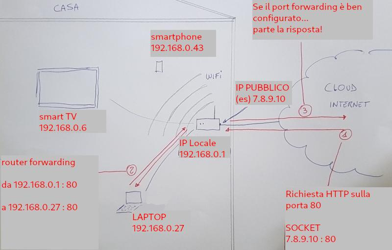
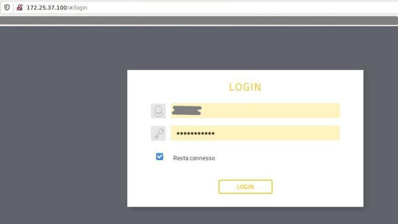
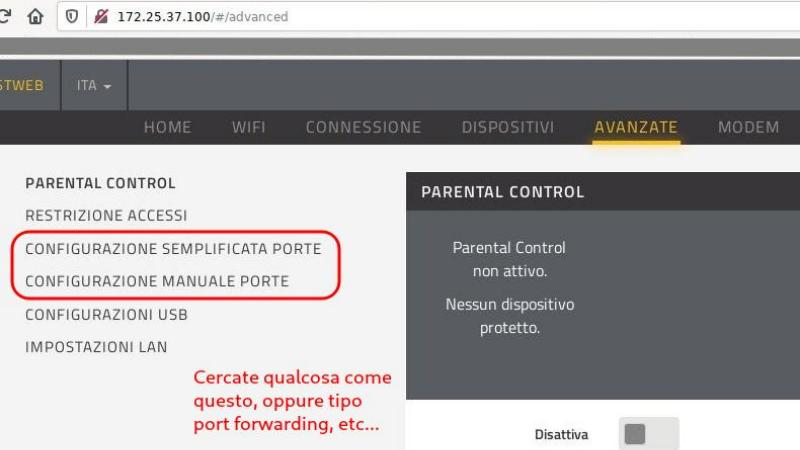

# Port Forwarding

!!! note "Argomenti teorici e requisiti tecnici"
    
    Prerequisti: **Browsing**
    
    Argomenti trattati: **Protocolli di trasporto**

Il Port Forwarding è una abilità del livello di trasporto che permette
di reindirizzare una connessione destinata ad un certo socket verso un
altro socket, quando questa attraversa un dispositivo di rete (un router
o un firewall). Esso è dunque una applicazione di NAT (Network Address
Translation) poiché, spostando uno dei socket target della connessione
rende possibile modificare l'IP (ovvero il mittente, oppure il
destinatario) della stessa.

L'idea di questa esercitazione, da fare a casa, è quella di rendere
disponibile un servizio installato su un computer locale sulla rete
internet, ridirigendo le richieste che arrivano al modem router di casa
dalla linea esterna verso il dispositivo interno che esegue un servizio.

Nella seguente immagine ho cercato di descrivere il problema immaginando
un generico server WEB disponibile sul LAPTOP sulla porta 80 e
raggiungibile dall'esterno tramite l'indirizzo IP (pubblico) del
router.

{style="width:100%"}

Qualche minuto di tempo per analizzare (e godere) del disegno...

Bene!

Per questa esperienza vi servono alcune informazioni relative alla rete
di casa vostra. Un buon inizio sarebbe individuare:

-   l'IP del vostro dispositivo (possibilmente un PC, oppure un Raspberry)
-   l'IP del modem/router/access point di casa vostra

Non dovrebbe essere difficile desumerli osservando l'output del comando
*ipconfig* (Windows) oppure *ifconfig* (Linux, Mac). L'IP del proprio
dispositivo è quello indicato accanto alla scheda di rete; l'IP del
proprio dispositivo di rete è solitamente il gatewar/server DHCP che
desumete dalle informazioni di rete.

Adesso dovete collegarvi al router di casa vostra. Di solito le
informazioni di accesso (IP, user, pass) sono proprio sul router, su una
etichetta o su una placchetta sul retro/fondo del dispositivo.

Collegatevi utilizzando il browser e digitando l'URL:
**http://IP_del_router**. Ad esempio potrebbe essere qualcosa tipo
*http://192.168.1.1*. A casa mia la rete è un pò particolare :)

{style="width:100%"}

Adesso all'interno dell'interfaccia di configurazione del router
dovete trovare qualcosa tipo **configurazione porte**, **port Forwarding**, **virtual server**, etc...

{style="width:100%"}

Da lì la configurazione è diversa per ogni router... posso aiutarvi poco :(

Quello che dovete fare è abbinare i due socket che devono comunicare
(quello sul dispositivo e quello sul router).

**IP del router : 80 -----> IP del PC/Raspberry : 80**

Ricordate che siete sull'interfaccia del router, quindi il suo IP è
solitamente implicito. Resta da indicare la porta da ascoltare (nel
nostro esempio la porta 80, HTTP) e il socket che la deve ricevere (IP
del dispositivo, il PC o il Raspberry, e ancora porta 80 oppure porta
HTTP).

**Buona Fortuna!**

PS: fortuna, un corno! Dovete riuscirci...

PPS: quello che poi potete farci con il port Forwarding dipende dalle
vostre conoscenze sul livello superiore!

 
 

